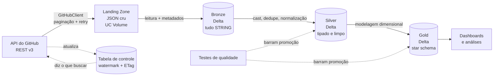
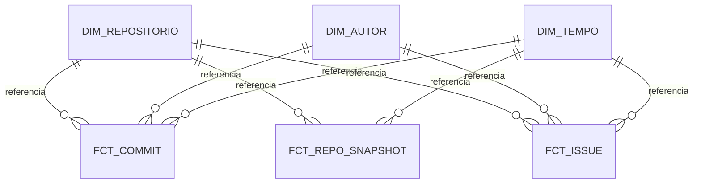

# radar-ecossistema-dados

[](https://github.com/gabrielxal/radar-ecossistema-dados/actions/workflows/testes.yml)

Pipeline de dados fim-a-fim que coleta a atividade de 14 projetos open source de engenharia
de dados pela API do GitHub e entrega um modelo dimensional capaz de responder perguntas
sobre a saúde desses projetos.

`Python` · `PySpark` · `Delta Lake` · `Databricks` · `Kimball` · `pytest`

## A pergunta

> Quais ferramentas do ecossistema de engenharia de dados estão saudáveis, e quais estão
> morrendo? Onde há risco de concentração de manutenção?

Repositórios acompanhados: `airflow`, `spark`, `dbt-core`, `duckdb`, `polars`, `delta`,
`dagster`, `prefect`, `trino`, `great_expectations`, `iceberg`, `hudi`, `sqlfluff`,
`datahub`.

## O que o pipeline já respondeu

A primeira pergunta filha: o ecossistema é sustentado por trabalho remunerado em horário
comercial, ou por voluntariado?

```
dia útil       2.624 commits/dia (média)
fim de semana    665 commits/dia (média)   →  25,4%
```

Trabalho remunerado. O fim de semana é consistente, com 1.331 commits em 90 dias, mas roda a
um quarto do ritmo de um dia útil, contra os 28,6% que uma distribuição uniforme daria.
Sábado supera domingo em 13%, o que sugere transbordo da semana em vez de tempo dedicado.

O que torna a resposta interessante é que a leitura ingênua do mesmo fato dá outro resultado:

| Dia | Leitura bruta | Leitura corrigida |
|---|---|---|
| segunda | 28,2% | 16,8% |
| terça | 17,1% | 19,9% |
| quarta | 16,0% | 19,4% |
| quinta | 16,2% | 17,9% |
| sexta | 14,0% | 16,7% |
| sábado | 4,4% | 4,9% |
| domingo | 4,1% | 4,3% |

Na leitura bruta, segunda-feira aparece como o dia mais produtivo do ecossistema, quando é o
penúltimo. Três decisões analíticas separam uma coluna da outra: usar a data de autoria em
vez da data de commit, descartar commits registrados mais de 7 dias depois de escritos, e
excluir bots. Nenhuma veio de dado novo. Elas ficaram visíveis porque o modelo dimensional as
expõe como escolha, e não embutidas numa consulta direta sobre a camada silver.

O detalhamento está em [`docs/PROJETO.md`](docs/PROJETO.md), seção 10.6.

### Onde há risco de concentração de manutenção

Bus factor é quantas pessoas concentram metade dos commits. O nome vem de quantas
precisariam ser atropeladas por um ônibus para o projeto parar.

| Repositório | Bus factor | Autores em 90d | Commits em 90d |
|---|---|---|---|
| great-expectations | **1** | 13 | 93 |
| trino | 3 | 58 | 826 |
| dagster | 4 | 40 | 346 |
| hudi | 4 | 44 | 388 |
| duckdb | 4 | 143 | 5.657 |
| prefect | 5 | 48 | 126 |
| polars | 5 | 64 | 495 |
| sqlfluff | 7 | 74 | 268 |
| datahub | 10 | 95 | 1.095 |
| spark | 11 | 186 | 1.555 |
| dbt-core | 12 | 63 | 946 |
| delta | 12 | 73 | 382 |
| iceberg | 12 | 98 | 395 |
| airflow | 16 | 324 | 2.010 |

O `great_expectations` tem uma pessoa respondendo por metade dos commits num time de 13. É o
único ponto único de falha da lista.

`duckdb` chama atenção pelo oposto: 143 contribuidores e apenas 4 concentram metade, com
5.657 commits no período. É o núcleo mais denso e ao mesmo tempo o repositório mais ativo,
por larga margem.

### Acelerando ou desacelerando

A pergunta é sobre volume **e** sobre volume por pessoa, porque as duas colunas podem
discordar. Comparando dois períodos de 45 dias:

| Repositório | Volume | Por autor | O que é |
|---|---|---|---|
| dagster | **-52%** | -11% | time e produção caindo juntos |
| great-expectations | **+79%** | -11% | time dobrou; a queda por autor é gente nova entrando |
| prefect | -18% | -48% | 33 pessoas produzindo 1,7 commit cada |
| iceberg | +17% | +23% | menos gente entregando mais |
| airflow | -10% | -8% | estável |

O `dagster` é o único onde as duas colunas caem forte junto, e é o sinal mais claro de
declínio no conjunto.

O `great_expectations` mostra por que ler só a coluna da direita engana: `-11%` por autor
parece deterioração, e o volume quase dobrou.

**Um confundidor declarado:** onze dos catorze têm variação por autor negativa. As janelas
são 27/05 a 11/07 e 11/07 a 25/08, e a segunda pega agosto inteiro, mês de férias no
hemisfério norte de onde vem a maior parte destes contribuidores. Boa parte da queda
generalizada é provavelmente sazonal. Isso não afeta os casos extremos, mas impede ler
qualquer `-5%` como sinal.

### Fechar rápido não é o mesmo que dar conta

Duas medidas com significados opostos, nos repositórios cujo histórico de issues foi coletado
por inteiro:

| Repositório | Aberto | Mediana até fechar | Idade do backlog aberto |
|---|---|---|---|
| sqlfluff | 8% | **12 dias** | **1.216 dias** |
| dagster | 14% | **36 dias** | **1.467 dias** |
| delta | 19% | 109 dias | 342 dias |
| hudi | 24% | 207 dias | 268 dias |

`sqlfluff` e `dagster` fecham rápido e carregam backlog de três a quatro anos: triam o fácil e
deixam o resto. `hudi` e `delta` fecham devagar com backlog novo: trabalham a fila em ordem.

Olhando só a coluna do meio, `sqlfluff` pareceria três vezes mais saudável que `delta`. É por
isso que a consulta tem as duas.

### Quem reporta e quem corrige são populações diferentes

| | |
|---|---|
| Autores de commit (90 dias) | 1.332 |
| Autores de issue (histórico) | 22.893 |
| Presentes nos dois | 542 |

Dos que commitaram no período, 41% também abriram issue. O caminho inverso não é
interpretável, porque as janelas são assimétricas: quem commitou em 2019 e abriu issue em 2019
aparece só do lado das issues.

O que fica de pé é a consequência de projeto: sem uma dimensão de autor conformada entre os
dois fatos, 95% da população que participa cairia no membro desconhecido, e a pergunta sobre
concentração de manutenção não teria como ser respondida fora do núcleo.

## O que deu errado no caminho

Estas duas entradas são o motivo de o projeto existir em forma de documento, e não só de
código.

### O pipeline apagava histórico e reportava sucesso

Duas proteções corretas isoladamente se combinaram num defeito. O `limite_paginas` protegia a
quota da API. O watermark registrava até onde a coleta tinha chegado. Como a API devolve
commits do mais novo para o mais antigo, o teto cortava a coleta no meio da janela e o
watermark avançava como se ela tivesse sido percorrida inteira. O que ficou para trás nunca
mais era buscado.

Cinco dos catorze repositórios estavam com até dois meses faltando, com `status='ok'` na
tabela de controle. Nenhuma bateria de qualidade acusou, porque todas verificavam o dado que
chegou e nenhuma perguntava o que deveria ter chegado.

A correção tem três partes: `paginar()` informa quando parou pelo teto, o controle grava
`status='truncado'`, e o watermark não avança nesse caso. A recuperação custou 311
requisições de uma quota de 5.000 por hora e levou a bronze de 5.646 para 18.537 linhas.

### A amostra estava correta e a conclusão estava errada

Depois da recuperação, a proporção de commits de bot caiu de 10,5% para 4,9%.

As 5.646 linhas anteriores estavam todas certas. A conclusão tirada delas estava errada por
um fator de dois, porque a truncagem atingia justamente os repositórios maiores, que eram os
que estouravam o teto de páginas. Perda silenciosa raramente é uniforme: ela segue o
mecanismo que a causou e desloca proporções, não apenas contagens.

## Arquitetura



A ingestão é incremental por watermark, com ETag numa URL fixa funcionando como sentinela: se
o topo da lista não mudou, a API responde `304` e o repositório é pulado sem consumir quota.

O teto de páginas, que já apagou histórico em silêncio uma vez, é neutralizado de dois jeitos
diferentes conforme o que a API oferece. Em `/commits`, que aceita `until`, a coleta é fatiada
em janelas de uma semana. Em `/issues`, que não aceita, a lista é percorrida em ordem
crescente, então o corte pelo teto descarta os registros que a execução seguinte vai buscar de
qualquer forma.

## O modelo dimensional



Kimball define três tipos de tabela fato, e o modelo usa os três.

| Tabela | Tipo | Grão | O que só ela responde |
|---|---|---|---|
| `fct_commit` | transação | um commit | quando o trabalho aconteceu |
| `fct_repo_snapshot` | snapshot periódico | um repositório por dia | como stars e forks evoluem |
| `fct_issue` | snapshot acumulado | uma issue | quanto tempo um processo leva, e quanto já dura o que não terminou |

| Dimensão | Tipo | Grão |
|---|---|---|
| `dim_repositorio` | SCD2 | uma versão de repositório |
| `dim_autor` | SCD1, conformada | um autor |
| `dim_tempo` | calendário | um dia |

Dois detalhes do modelo que valem mais que o desenho:

`dim_tempo` entra em `fct_commit` com dois papéis, `sk_data_autoria` e `sk_data_commit`. Foi
essa separação que revelou a diferença entre trabalho feito no período e história anterior
absorvida de uma vez, e é ela que sustenta a tabela de dias da semana acima.

`dim_autor` é conformada: lê das silvers de commits e de issues, porque os dois fatos apontam
para ela e quem abre issue nem sempre commita. Construída só de commits, todo relator externo
cairia no membro desconhecido.

O snapshot acumulado costuma ser o mais caro dos três, porque a linha sofre `UPDATE` a cada
marco. Aqui não precisou de mecanismo de escrita próprio: as chaves substitutas são
determinísticas e a gold é reconstruída por `overwrite`, então o `UPDATE` acontece por
reconstrução.

## Estrutura

```
src/radar/            lógica testável, sem dependência de notebook
  github_client.py        paginação, retry com backoff, ETag
  ingestao.py             watermark, sentinela, janelas, landing zone
  controle.py             checkpoints
  bronze.py               landing → Delta, tudo STRING, com proveniência
  silver_comum.py         tipagem e leitura incremental, comuns às três silvers
  silver.py               commits: quarentena e MERGE
  silver_repositorios.py  fotos diárias
  silver_issues.py        issues e pull requests, separados
  gold.py                 dimensões, fatos, chaves substitutas determinísticas
  qualidade.py            baterias que barram promoção entre camadas

notebooks/          orquestração fina, um passo por notebook
orquestracao/       definições dos jobs do Databricks, versionadas
tests/              439 casos
docs/PROJETO.md     as decisões e por que as alternativas foram rejeitadas
```

## Rodando

Pré-requisitos: Python 3.10+, um workspace Databricks (a Free Edition basta) e um
fine-grained token do GitHub com permissão de leitura em repositórios públicos.

```bash
python -m venv .venv
source .venv/Scripts/activate    # Linux/macOS: source .venv/bin/activate
python -m pip install -e ".[dev]"

cp .env.example .env            # preencha GITHUB_TOKEN
```

No Databricks, os notebooks rodam em ordem. `00` e `01` são de preparação e rodam uma vez;
`02` em diante formam o pipeline.

## Testes

```bash
python -m pytest -m "not spark"   # 294 casos, sem JVM, ~0,5s
python -m pytest                  # 439 casos, sobe Spark local
```

A suíte rápida não depende de Spark nem de rede. A suíte completa exige `pyspark`, que é
dependência de desenvolvimento: no Databricks o motor vem do cluster.

As duas rodam no GitHub Actions a cada push e pull request. A rápida roda em duas versões de
Python, 3.10 e 3.12, que são os extremos do que o `pyproject.toml` declara suportar, e o faz
instalando apenas `.[test]`, sem pyspark.

Essa ausência é o ponto. A lógica mora em `src/` e não nos notebooks justamente para poder ser
testada sem motor, e até então isso era só uma afirmação: a máquina de desenvolvimento sempre
teve pyspark instalado. O job que instala sem ele transforma a afirmação em verificação, e um
passo dedicado falha se pyspark entrar no grupo errado de dependências.

No Windows, os testes que leem arquivo precisam de `winutils.exe` e `hadoop.dll` apontados por
`HADOOP_HOME` no `.env`. Sem essa variável eles são pulados, não quebrados.

Spark local cobre schema, `from_json`, casts e deduplicação. Não cobre Delta, Volume nem Unity
Catalog: `MERGE`, `saveAsTable` e `DESCRIBE HISTORY` seguem validados apenas no Databricks.

## Orquestração

Dois jobs, com cadências diferentes decididas por uma pergunta só: o dado perdido volta?

| Job | Cadência | O que faz |
|---|---|---|
| `snapshot-diario-radar` | diária | coleta a foto de stars, forks e issues abertas |
| `pipeline-completo-radar` | semanal | ingestão até os fatos, nove tarefas em DAG |

Commits têm 90 dias de histórico consultável, então uma execução perdida se conserta na
seguinte. Stars e forks não têm passado consultável: o dia não coletado está perdido para
sempre, e por isso ganharam job próprio.

## Documentação

[`docs/PROJETO.md`](docs/PROJETO.md) registra cada decisão com a alternativa que foi
rejeitada e o porquê, além de um diário de bordo com os erros encontrados e o que cada um
ensinou.
