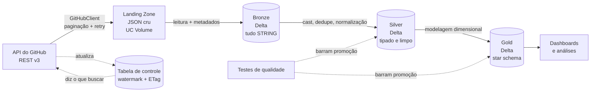
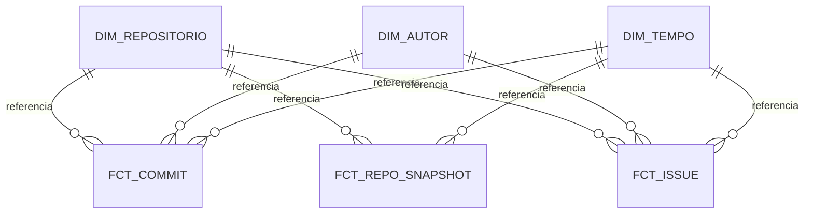

# radar-ecossistema-dados

[](https://github.com/gabrielxal/radar-ecossistema-dados/actions/workflows/testes.yml)

Projeto de estudo de engenharia de dados. A ideia foi partir de uma pergunta real, construir o
pipeline inteiro necessário para respondê-la, e registrar tudo que deu errado no caminho.

`Python` · `PySpark` · `Delta Lake` · `Databricks` · `Kimball` · `pytest`

---

## O que o projeto faz

Coleta a atividade de 14 projetos open source do ecossistema de dados pela API do GitHub,
organiza esse dado em três camadas sobre Delta Lake, e monta um modelo dimensional que responde
perguntas sobre a saúde desses projetos.

Em números, hoje: 18.673 commits, 73.682 issues e pull requests, e uma série de fotos diárias
que cresce sozinha desde que a orquestração entrou no ar.

### A pergunta que originou tudo

> Quais ferramentas do ecossistema de engenharia de dados estão saudáveis, e quais estão
> morrendo? Onde há risco de concentração de manutenção?

O recorte foi escolhido de propósito: um engenheiro de dados analisando as ferramentas de
engenharia de dados.

Dela saíram cinco perguntas menores, e cada uma exigiu uma peça diferente do modelo. Foi assim
que o projeto ganhou forma, e é por isso que ele tem SCD2 e três tipos de fato em vez de uma
tabela só.

| Pergunta | O que ela obrigou a construir |
|---|---|
| O projeto acelera ou desacelera, por contribuidor ativo? | série temporal e normalização por autor |
| Bus factor: quantas pessoas concentram metade dos commits? | dimensão de autor conformada entre dois fatos |
| Quanto tempo uma issue leva para fechar? | fato com múltiplos marcos, o snapshot acumulado |
| O histórico antigo muda quando o repositório muda? | Slowly Changing Dimension tipo 2 |
| O ecossistema é sustentado por trabalho remunerado ou voluntariado? | dimensão de tempo com dois papéis |

### Os 14 repositórios, e por que estes

| Camada | Repositórios | |
|---|---|---|
| Orquestração | `airflow`, `dagster`, `prefect` | 3 |
| Processamento | `spark`, `duckdb`, `polars` | 3 |
| Formato de tabela | `delta`, `iceberg`, `hudi` | 3 |
| Transformação | `dbt-core`, `sqlfluff` | 2 |
| Query federada | `trino` | 1 |
| Qualidade | `great_expectations` | 1 |
| Catálogo | `datahub` | 1 |

Três nas camadas onde existe disputa real, um ou dois onde não existe.

Isso muda o que a análise consegue dizer. Comparar `airflow` com `duckdb` diz pouco, porque
resolvem problemas diferentes. Comparar `delta` com `iceberg` e `hudi` diz muito: são três
projetos disputando o mesmo lugar, e bus factor e ritmo entre eles apontam qual está ganhando.

O que ficou de fora limita a conclusão, e vale dizer antes que o leitor perceba sozinho:

| Ausente | Efeito |
|---|---|
| Streaming (`kafka`, `flink`) | metade da disciplina não é medida; tudo aqui é batch |
| OLAP distribuído (`clickhouse`, `druid`) | `duckdb` e `trino` são query engines, não bancos analíticos |
| BI (`superset`, `metabase`) | a camada de apresentação do stack não é medida; o painel deste projeto é do Databricks, que é produto fechado |
| Ingestão declarativa (`dlt`, `airbyte`) | a camada EL do stack moderno não aparece |

Databricks e S3 não entram por outro motivo: são produtos fechados, sem repositório público, e
um pipeline que mede saúde de repositório não tem o que medir neles.

---

## O que eu aprendi construindo isto

Estas são as lições que sobraram depois de tudo, e nenhuma veio de tutorial. As seis primeiras
custaram um erro registrado na seção de dificuldades; a última veio de uma decisão, e não de um
tropeço.

### 1. O defeito mais caro é o que não falha

O pipeline apagou três meses de histórico de cinco repositórios e reportou `status='ok'`.
Nenhuma bateria de qualidade acusou, porque todas verificavam **o dado que chegou** e nenhuma
perguntava **o que deveria ter chegado**.

Aprendi que essas são duas perguntas diferentes, e que a segunda quase nunca é feita. Hoje o
projeto tem uma reconciliação por camada: `landing = bronze` e `bronze = soma dos destinos da
silver`. É a verificação que teria pego o defeito no dia em que ele nasceu.

### 2. Amostra correta pode gerar conclusão errada

Depois de recuperar o histórico, a proporção de commits feitos por bot caiu de 10,5% para 4,9%.
As linhas que eu tinha antes estavam todas certas; a conclusão tirada delas estava errada por um
fator de dois.

O motivo é estrutural: a perda atingia justamente os repositórios maiores, porque eram eles que
estouravam o teto de páginas. **Perda silenciosa raramente é uniforme.** Ela segue o mecanismo
que a causou, e por isso desloca proporções, não apenas contagens.

Essa lição voltou duas vezes depois, com issues, e nas duas eu já sabia o que procurar.

### 3. Restrição gera arquitetura melhor que boa prática copiada

A ingestão é incremental por watermark com ETag não porque incremental é elegante, mas porque a
API dá 5.000 requisições por hora e o histórico não cabe numa carga só. Uma sondagem da API
definiu a arquitetura antes de eu escrever a primeira linha de código.

A diferença aparece no resultado: cada decisão tem uma restrição atrás dela, e dá para explicar
todas sem recorrer a "é assim que se faz".

### 4. O modelo dimensional expõe a decisão analítica

A mesma pergunta, sobre o mesmo fato, admitiu duas respostas opostas. Na leitura ingênua,
segunda-feira era o dia mais produtivo do ecossistema. Na leitura corrigida, era o penúltimo.

Três decisões separavam uma da outra, e nenhuma veio de dado novo: usar a data de autoria em vez
da data de commit, descartar commits registrados muito depois de escritos, e excluir bots.

Numa consulta direta sobre a camada silver essas escolhas estariam embutidas e invisíveis. O
modelo dimensional as obriga a aparecer, e é isso que permite questioná-las.

### 5. Acrescentar um fato quebra coisas que ninguém declarou

Ao ligar `fct_issue` ao modelo, quatro coisas quebraram no mesmo dia. Nenhuma no código novo:
todas em código antigo que assumia algo sobre o modelo sem nunca ter escrito o quê.

`montar_fct_issue` não menciona `dim_tempo` em lugar nenhum, e mesmo assim depende do intervalo
que ela cobre. Uma issue de 2015 gerou 79.794 chaves de tempo órfãs, porque o calendário tinha
sido gerado a partir de commits de 90 dias.

Isso tem nome fora daqui: acoplamento sem declaração. E o que reduziu o custo foi **onde** cada
verificação morava. As que estavam em `src/` com teste falharam na minha máquina em segundos; as
que estavam em `assert` de notebook falharam no Databricks, depois de esperar cluster.

### 6. Hipótese escrita antes de medir às vezes se mostra errada, e isso é bom

Suspeitei que o `airflow` inflava os próprios números fechando issue parada por bot. Escrevi a
suspeita, medi, e estava errado: ele tem uma das menores taxas de abandono do conjunto.

O caso era o `iceberg`, com 43% das issues fechadas sem serem resolvidas. E isso desmontou uma
classificação que eu tinha feito uma hora antes.

Registrar a hipótese antes do resultado foi o que tornou o erro visível. Se eu tivesse medido
primeiro e escrito depois, teria escrito só a conclusão certa e perdido a lição.

### 7. Adotar um recurso é fácil; saber onde ele não cabe é a decisão

O Delta oferece `CHECK` constraints, e a tentação é ligar em tudo. Mas `CHECK` aborta a
transação inteira quando uma linha viola, e é justamente isso que eu tinha recusado na silver:
um registro torto da origem não pode derrubar a carga semanal.

A pergunta que separou os dois casos não é sobre o recurso, é sobre a origem do defeito:

> uma violação aqui é sujeira que chegou, ou defeito do meu próprio código?

A bronze e a silver ingerem dado externo, então a resposta é sujeira, e o instrumento certo é a
quarentena — isola a linha, registra o motivo, deixa a carga passar. A gold não ingere nada:
ela é derivada pelo meu código. Ali a resposta é defeito meu, e carga que grava defeito de
derivação deve mesmo abortar.

O contraexemplo é que fixou a regra. `dias_ate_o_commit >= 0` parece a restrição mais óbvia do
modelo e foi rejeitada, porque relógio de contribuidor adiantado produz negativo legítimo.
Existe um teste que falha se ela entrar: decisão rejeitada sem guarda é decisão que volta.

---

## Resumo dos resultados

Leitura de 2026-08-25, sobre 90 dias de commits e o histórico completo de issues.

### Onde há risco de concentração

Bus factor é quantas pessoas concentram metade dos commits.

| Repositório | Bus factor | Autores | Commits em 90d |
|---|---|---|---|
| great-expectations | **1** | 13 | 93 |
| trino | 3 | 58 | 826 |
| dagster | 4 | 40 | 346 |
| hudi | 4 | 44 | 388 |
| duckdb | 4 | 143 | 5.657 |
| prefect | 5 | 48 | 126 |
| polars | 5 | 64 | 495 |
| sqlfluff | 7 | 74 | 268 |
| datahub | 10 | 95 | 1.095 |
| spark | 11 | 186 | 1.555 |
| dbt-core | 12 | 63 | 946 |
| delta | 12 | 73 | 382 |
| iceberg | 12 | 98 | 395 |
| airflow | 16 | 324 | 2.010 |

O `great_expectations` é o único ponto único de falha do conjunto: uma pessoa responde por
metade dos commits num time de 13.

O `duckdb` chama atenção pelo oposto. Tem 143 contribuidores, e 4 concentram metade, com 5.657
commits no período. É o núcleo mais denso e ao mesmo tempo o repositório mais ativo, por larga
margem.

### Acelerando ou desacelerando

Dois períodos de 45 dias, comparando volume e volume por pessoa.

| Repositório | Volume | Por autor | Leitura |
|---|---|---|---|
| dagster | **-52%** | -11% | time e produção caindo juntos |
| great-expectations | **+79%** | -11% | time dobrou; a queda por autor é gente nova entrando |
| prefect | -18% | -48% | 33 pessoas produzindo 1,7 commit cada |
| iceberg | +17% | +23% | menos gente entregando mais |
| airflow | -10% | -8% | estável |

O `dagster` é o único onde as duas colunas caem forte junto.

O `great_expectations` mostra por que ler só a coluna da direita engana: `-11%` por autor parece
deterioração, e o volume quase dobrou.

Onze dos catorze têm variação por autor negativa, o que é uniforme demais para ser coincidência.
As duas janelas são 27/05 a 11/07 e 11/07 a 25/08, e a segunda pega agosto inteiro, mês de
férias no hemisfério norte de onde vem a maior parte destes contribuidores. Boa parte da queda
generalizada provavelmente é sazonal.

### Fechar rápido não é o mesmo que dar conta

73.682 issues. Duas medidas com significados opostos: uma olha o que terminou e mede vazão, a
outra olha o que não terminou e mede backlog.

| Repositório | Aberto | Mediana até fechar | Idade do backlog aberto |
|---|---|---|---|
| dagster | 14% | 36 dias | **1.468 dias** |
| trino | 30% | 14 dias | **1.255 dias** |
| sqlfluff | 8% | 12 dias | **1.217 dias** |
| airflow | 3% | 10 dias | 962 dias |
| prefect | 10% | 13 dias | 854 dias |
| polars | 19% | **2 dias** | 628 dias |
| great_expectations | 1% | 58 dias | 563 dias |
| dbt-core | 10% | 22 dias | 561 dias |
| datahub | 18% | 52 dias | 429 dias |
| delta | 19% | 110 dias | 343 dias |
| hudi | 24% | 207 dias | 269 dias |
| iceberg | 10% | 195 dias | 111 dias |
| spark | 39% | 101 dias | 63 dias |
| duckdb | 5% | **8 dias** | **35 dias** |

`dagster`, `trino` e `sqlfluff` fecham em duas semanas e carregam backlog de três a quatro anos:
o que entra e é simples sai rápido, o resto envelhece.

`hudi` e `delta` fecham devagar, entre 110 e 207 dias, e o backlog aberto é novo.

`duckdb` é o único com as duas medidas boas ao mesmo tempo, e somado a 5.657 commits em 90 dias
é o mais saudável do conjunto por qualquer ângulo medido aqui.

Olhando só a coluna do meio, `polars` pareceria 50 vezes mais eficiente que `hudi`. Olhando só a
da direita, o oposto.

### Fechar não é o mesmo que resolver

As duas medidas acima ainda deixam uma confusão de pé: projeto que fecha issue parada por
inatividade aparece com vazão rápida e backlog jovem sem ter atendido ninguém.

O campo `motivo_estado` separa os dois casos.

| Repositório | Abandonadas | Resolvidas | Taxa |
|---|---|---|---|
| iceberg | 1.691 | 2.224 | **43,2%** |
| delta | 397 | 1.150 | 25,7% |
| datahub | 444 | 1.860 | 19,3% |
| dbt-core | 999 | 4.658 | 17,7% |
| prefect | 769 | 4.459 | 14,7% |
| duckdb | 666 | 4.845 | 12,1% |
| hudi | 245 | 2.414 | 9,2% |
| polars | 958 | 9.564 | 9,1% |
| great_expectations | 188 | 1.867 | 9,1% |
| trino | 460 | 5.141 | 8,2% |
| airflow | 841 | 10.702 | 7,3% |
| dagster | 227 | 3.273 | 6,5% |
| sqlfluff | 56 | 3.382 | **1,6%** |

O `iceberg` fecha quase metade sem resolver, e isso muda a leitura dele na tabela anterior: 195
dias até fechar com o backlog mais jovem dos catorze não é fila trabalhada em ordem, é fila
expurgada.

O `sqlfluff` é o oposto exato. Com 1,6%, a mediana de 12 dias dele é resolução de verdade, e o
backlog de 1.217 dias é acúmulo de verdade.

O `spark` mede outra coisa: são 100 issues num projeto de 2010, porque o canal de discussão dele
é o JIRA.

### Quem reporta e quem corrige

| | |
|---|---|
| Autores de commit (90 dias) | 1.332 |
| Autores de issue (histórico) | 22.893 |
| Presentes nos dois | 542 |

Dos que commitaram no período, 41% também abriram issue. O caminho inverso não é interpretável,
porque as janelas são assimétricas.

A consequência de projeto é que sem uma dimensão de autor conformada entre os dois fatos, 95% da
população que participa cairia no membro desconhecido.

### Trabalho remunerado ou voluntariado

```
dia útil       2.624 commits/dia (média)
fim de semana    665 commits/dia (média)   →  25,4%
```

Trabalho remunerado. O fim de semana é consistente, com 1.331 commits em 90 dias, mas roda a um
quarto do ritmo de um dia útil, contra os 28,6% que uma distribuição uniforme daria.

---

## Dificuldades encontradas

O diário de bordo completo tem 29 entradas, em [`docs/PROJETO.md`](docs/PROJETO.md). Estas são as
que mais custaram.

### O pipeline apagou histórico e disse que estava tudo bem

Duas proteções corretas isoladamente se combinaram num defeito.

O `limite_paginas` protegia a quota da API. O watermark registrava até onde a coleta tinha
chegado. Como a API devolve commits do mais novo para o mais antigo, o teto cortava a coleta no
meio da janela e o watermark avançava como se ela tivesse sido percorrida inteira. O que ficou
para trás nunca mais era buscado.

Cinco dos catorze repositórios estavam com até dois meses faltando, todos com `status='ok'`.

A correção tem três partes: `paginar()` passou a informar quando parou pelo teto, o controle
grava `status='truncado'`, e o watermark não avança nesse caso. A recuperação custou 311
requisições e levou a bronze de 5.646 para 18.537 linhas.

Depois disso o teto deixou de decidir quanto histórico se perde, de dois jeitos conforme o que a
API oferece. Em `/commits`, que aceita `until`, a coleta virou fatiada em janelas de uma semana.
Em `/issues`, que não aceita, a lista passou a ser percorrida em ordem crescente: o corte pelo
teto descarta os registros que a execução seguinte vai buscar de qualquer forma.

### O mesmo erro voltou com issues, e dessa vez eu esperava

O backfill de issues leva várias execuções nos repositórios grandes. Enquanto ele não termina, o
que chegou é a parte mais velha e já fechada do backlog, porque issue aberta recebe comentário e
fica no fim da caminhada crescente.

O `duckdb` chegou a aparecer com **zero issues abertas** em 5.048. Não era defeito de código, era
leitura de coleta incompleta.

A resposta foi uma consulta que junta a tabela de controle com a silver e devolve uma coluna
`confiavel`. Ela é o portão da pergunta sobre issues, e existe porque a mesma armadilha já tinha
custado caro uma vez.

### Diagnóstico feito com a ferramenta errada custou três rodadas

Um defeito corrigido em `src/` continuava aparecendo no Databricks. Módulo já importado permanece
em `sys.modules` pelo resto da vida do interpretador, e o `git pull` não desfaz isso.

O que fez perder tempo foi o diagnóstico: usei `inspect.getsource(modulo)` para conferir se o
código carregado era o novo. Ele lê **o arquivo em disco**, que já estava atualizado, e respondeu
que sim. A pergunta certa era `hasattr(modulo, "SIMBOLO_NOVO")`, que interroga a memória.

Pergunta feita ao alvo errado devolve resposta verdadeira e inútil.

### Restrições da plataforma apareceram só em execução

Três incidentes com a mesma raiz: o Serverless do Databricks não é um Spark comum.

`spark.conf` tem lista fechada de permissões, `df.cache()` não existe, e magics do IPython não são
reconhecidas. Nada disso aparece em teste local, e todos apareceram no meio de uma carga.

Hoje há uma bateria de testes que lê o código-fonte e barra `.cache()`, `%load_ext` e configuração
fora da lista permitida, antes de qualquer coisa subir.

---

## Como foi construído

### Arquitetura



A ingestão é incremental por watermark, com ETag numa URL fixa funcionando como sentinela: se o
topo da lista não mudou, a API responde `304` e o repositório é pulado sem consumir quota.

### O modelo dimensional



Kimball define três tipos de tabela fato, e o modelo usa os três porque as perguntas exigiram os
três.

| Tabela | Tipo | Grão | O que só ela responde |
|---|---|---|---|
| `fct_commit` | transação | um commit | quando o trabalho aconteceu |
| `fct_repo_snapshot` | snapshot periódico | um repositório por dia | como stars e forks evoluem |
| `fct_issue` | snapshot acumulado | uma issue | quanto já dura o que não terminou |

| Dimensão | Tipo | Grão |
|---|---|---|
| `dim_repositorio` | SCD2 | uma versão de repositório |
| `dim_autor` | SCD1, conformada | um autor |
| `dim_tempo` | calendário | um dia |

Três detalhes valem mais que o desenho.

`dim_tempo` entra em `fct_commit` com dois papéis, `sk_data_autoria` e `sk_data_commit`. Foi essa
separação que revelou a diferença entre trabalho feito no período e história anterior absorvida
de uma vez.

`dim_autor` lê das silvers de commits e de issues, porque os dois fatos apontam para ela e quem
abre issue nem sempre commita.

O snapshot acumulado costuma ser o mais caro dos três, porque a linha sofre `UPDATE` a cada
marco. Aqui não precisou de mecanismo de escrita próprio: as chaves substitutas são
determinísticas e a gold é reconstruída por `overwrite`, então o `UPDATE` acontece por
reconstrução.

### A camada de consumo

O pipeline terminava na gold sem ninguém consumindo. O que faltava não era mais uma consulta —
elas já existiam — e sim um lugar estável de onde um painel pudesse lê-las.

A decisão está em onde o SQL do painel mora. Colado dentro de cada widget, ele seria uma segunda
cópia da lógica, sem teste e livre para divergir. Materializado como tabela, congelaria a janela
de 45 dias no dia da carga. As análises viraram **visões** sobre a gold, e cada widget é um
`SELECT *`.

Uma coluna nova saiu disso. `cobertura_do_backfill` existia desde a Etapa 6 e vivia numa célula
separada do notebook, o que deixava a leitura correta na mão de quem lembrasse de rodar as duas
consultas. Num painel isso não sobrevive: as colunas de issue aparecem ao lado das de commit,
com a mesma cara de fato consolidado, e nada na tela diz que as de um repositório ainda truncado
estão deslocadas. Agora `issues_confiavel` é coluna do painel, e o padrão de quem não sabe é
`false` — nulo se lê como "sem problema".

O layout está em [`dashboards/painel_de_saude.md`](dashboards/painel_de_saude.md), versionado
pelo mesmo motivo que as definições de job.

### Estrutura do repositório

```
src/radar/            lógica testável, sem dependência de notebook
  github_client.py        paginação, retry com backoff, ETag
  ingestao.py             watermark, sentinela, janelas, landing zone
  controle.py             checkpoints
  bronze.py               landing → Delta, tudo STRING, com proveniência
  silver_comum.py         tipagem e leitura incremental, comuns às três silvers
  silver.py               commits: quarentena e MERGE
  silver_repositorios.py  fotos diárias
  silver_issues.py        issues e pull requests, separados
  gold.py                 dimensões, fatos, chaves substitutas determinísticas
  qualidade.py            baterias que barram promoção entre camadas
  analises.py             as consultas que respondem as perguntas
  consumo.py              as análises expostas como visão, para o painel
  manutencao.py           restrições CHECK, retenção, leitura de versões
  desempenho.py           medida de armazenamento, desbalanceamento e plano

notebooks/          orquestração fina, um passo por notebook
orquestracao/       definições dos jobs do Databricks, versionadas
dashboards/         o layout do painel, versionado
tests/              620 casos
docs/PROJETO.md     as decisões e por que as alternativas foram rejeitadas
```

### Testes

São 620 casos, divididos por custo: 434 rodam sem subir JVM, em menos de um segundo, e 186 sobem
uma sessão Spark local.

A separação tem uma consequência que só apareceu no fim. O job de CI que roda a suíte rápida
instala o projeto **sem pyspark**, e isso transforma numa verificação o que antes era só uma
afirmação do documento: a lógica mora em `src/` para poder ser testada sem motor. Enquanto a
máquina de desenvolvimento tivesse pyspark instalado, um import no topo de um módulo passaria
despercebido.

Spark local cobre schema, `from_json`, casts e deduplicação. Não cobre Delta, Volume nem Unity
Catalog: `MERGE`, `saveAsTable` e `DESCRIBE HISTORY` seguem validados apenas no Databricks.

### Orquestração

Dois jobs, com cadências decididas por uma pergunta só: o dado perdido volta?

| Job | Cadência | O que faz |
|---|---|---|
| `snapshot-diario-radar` | diária | coleta a foto de stars, forks e issues abertas |
| `pipeline-completo-radar` | semanal | ingestão até o painel, onze tarefas em DAG |

Commits têm 90 dias de histórico consultável, então uma execução perdida se conserta na seguinte.
Stars e forks não têm passado consultável: o dia não coletado está perdido para sempre, e por
isso ganharam job próprio.

### Reproduzindo

Precisa de Python 3.10+, um workspace Databricks (a Free Edition basta) e um fine-grained token
do GitHub com leitura em repositórios públicos.

```bash
python -m venv .venv
source .venv/Scripts/activate    # Linux/macOS: source .venv/bin/activate
python -m pip install -e ".[dev]"

cp .env.example .env            # preencha GITHUB_TOKEN
python -m pytest -m "not spark"
```

No Databricks, os notebooks rodam em ordem: `00` e `01` preparam o catálogo e o segredo, e do
`02` ao `13` formam o pipeline. O `14` é um experimento de custo e roda à parte, à mão: ele
grava uma tabela de escala sintética para medir o que 18 mil linhas não conseguem exercitar.

---

## Documentação completa

[`docs/PROJETO.md`](docs/PROJETO.md) registra cada decisão com a alternativa que foi rejeitada e o
porquê, mais o diário de bordo com as 29 entradas de erro e o que cada uma ensinou.
