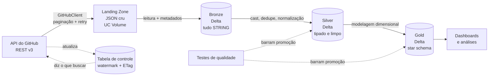
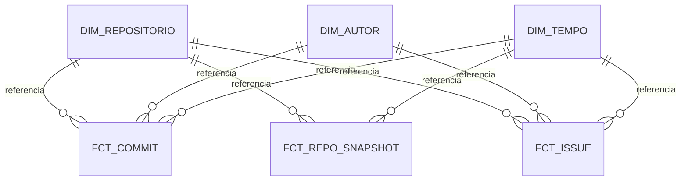

# Radar do Ecossistema de Dados: documento de projeto

> Documento vivo. Registra por que cada decisão foi tomada, não apenas o que foi feito.
> Atualizado ao final de cada etapa.

---

## Índice

1. [Contexto e objetivo](#1-contexto-e-objetivo)
2. [A problematização](#2-a-problematização)
3. [A fonte: API do GitHub](#3-a-fonte-api-do-github)
4. [Arquitetura](#4-arquitetura)
5. [Ingestão incremental: watermark e ETag](#5-ingestão-incremental-watermark-e-etag)
6. [Modelagem dimensional](#6-modelagem-dimensional)
7. [Decisões de tipagem](#7-decisões-de-tipagem)
8. [Decisões de engenharia de software](#8-decisões-de-engenharia-de-software)
9. [Diário de bordo](#9-diário-de-bordo)
10. [Roadmap e manutenção](#10-roadmap-e-manutenção)
11. [Referências](#11-referências)

---

## 1. Contexto e objetivo

Pipeline de dados fim-a-fim que ingere dados da API REST do GitHub, organiza-os em um
lakehouse com arquitetura medalhão sobre Delta Lake no Databricks, e entrega um
modelo dimensional capaz de responder perguntas sobre a saúde de projetos open source
do ecossistema de engenharia de dados.

O objetivo é duplo, e ambos importam:

| Objetivo | Como se manifesta no repositório |
|---|---|
| Aprender engenharia de dados moderna | Cada decisão documentada com a alternativa rejeitada |
| Comprovar competência para o mercado | Testes automatizados, CI, histórico de commits, documentação |

Um repositório de portfólio não é avaliado pelo código que roda, e sim pelo
raciocínio visível. É isso que este documento registra.

---

## 2. A problematização

### 2.1 Por que começar pela pergunta, não pelo dado

Engenharia de dados existe para responder pergunta de negócio. A arquitetura é
consequência da pergunta, nunca o contrário. Toda escolha técnica deste projeto é
rastreável até uma das perguntas abaixo.

### 2.2 A pergunta central

> Quais ferramentas do ecossistema de engenharia de dados estão saudáveis, e quais estão
> morrendo? Onde há risco de concentração de manutenção?

O recorte é deliberado: um engenheiro de dados analisando as ferramentas de engenharia de
dados. Sinaliza domínio de mercado, não apenas domínio de ferramenta.

### 2.3 As perguntas filhas e o que cada uma força na arquitetura

| # | Pergunta de negócio | Exigência arquitetural |
|---|---|---|
| 1 | O projeto acelera ou desacelera? Commits crescem, mas por contribuidor ativo também? | Série temporal + dimensão de tempo + normalização de métrica |
| 2 | Bus factor: quantas pessoas concentram 50% dos commits? | Análise de concentração; dimensão de autor conformada |
| 3 | Quanto tempo uma issue leva para receber a primeira resposta e para ser fechada? | Fato com múltiplos marcos temporais (*snapshot acumulado*) |
| 4 | Quando um repositório muda de linguagem, licença ou dono, o histórico antigo muda junto? | Slowly Changing Dimension Tipo 2 |
| 5 | O ecossistema é sustentado por trabalho remunerado em horário comercial, ou por voluntariado? | Dimensão de tempo com dois papéis: quando o código foi escrito e quando entrou |

A pergunta 4 é a que justifica a complexidade do modelo. Sem ela, SCD2 seria enfeite.

A pergunta 5 entrou depois das outras, e o motivo vale registro. Ela foi formulada durante a
análise, quando a dimensão de tempo com dois papéis revelou a diferença entre trabalho feito
no período e história anterior absorvida de uma vez. Foi a arquitetura sugerindo a pergunta,
e não o contrário, o que é o oposto do que a seção 2.1 defende. Aconteceu, e fica registrado
em vez de reescrito como se tivesse sido planejado.

As respostas estão em `notebooks/11_analises.py`, e as consultas em `src/radar/analises.py`.

### 2.4 A cadeia causal

Nenhuma decisão técnica deste projeto foi escolhida por gosto. Cada uma é forçada pela
anterior:

```
Pergunta: "quais projetos de dados estão saudáveis?"
        ↓ para responder, é preciso histórico
Commits e issues de ~14 repositórios, ao longo do tempo
        ↓ esse dado só existe na API do GitHub
A fonte é uma API
        ↓ a API tem teto de 5.000 req/hora (medido, não suposto)
Não cabe puxar tudo, todo dia
        ↓ só é possível puxar "o que mudou"
Ingestão INCREMENTAL é obrigatória
        ↓ incremental exige lembrar onde parou
CHECKPOINT persistido entre execuções
        ↓ o checkpoint guarda watermark e ETag
O cliente precisa EXPOR etag e rate limit
        ↓ requests.get() cru não entrega isso de forma utilizável
Uma camada que traduz HTTP em contrato próprio
        ↓
config.py e GitHubClient
```

Leia de baixo para cima: o `config.py` existe porque o GitHub tem rate limit. Se a API
fosse ilimitada, metade deste projeto não existiria.

### 2.5 Escopo

14 repositórios do ecossistema de dados, definidos em `src/radar/config.py`: `apache/airflow`,
`apache/spark`, `dbt-labs/dbt-core`, `duckdb/duckdb`, `pola-rs/polars`, `delta-io/delta`,
`dagster-io/dagster`, `PrefectHQ/prefect`, `trinodb/trino`,
`great-expectations/great_expectations`, `apache/iceberg`, `apache/hudi`, `sqlfluff/sqlfluff`,
`datahub-project/datahub`.

A lista vive num único lugar, nunca espalhada pelos notebooks.

---

## 3. A fonte: API do GitHub

### 3.1 Por que API e não arquivo estático

Arquivo CSV é o modo fácil: está completo, é imutável, e ou lê ou não lê. API é o modo real,
e falha de sete formas que arquivo nenhum reproduz:

| Desafio exclusivo de API | Por que é competência valorizada |
|---|---|
| Paginação | Exige laço que sabe quando parar, sem assumir o total |
| Falha parcial | 2.000 chamadas, 3 falham. Aborta tudo? Retenta? Continua? |
| Rate limit | Backoff, concorrência controlada, orçamento de requisições |
| Idempotência | Reprocessar um período sem duplicar o que já existe |
| Evolução de contrato | Campo novo aparece; campo some |
| Encoding | UTF-8 mal declarado transforma `Ação` em `Ação` |
| Resposta vazia com HTTP 200 | O modo de falha mais perigoso que existe |

### 3.2 A sondagem que determinou a arquitetura

Antes de projetar qualquer coisa, a API foi sondada com `curl`. As evidências medidas
abaixo determinaram o desenho da camada de ingestão:

| Evidência observada | Consequência de projeto |
|---|---|
| `"core": {"limit": 60}` sem token | 60 req/hora é inviável → autenticação obrigatória → gestão de segredo |
| `Link: <...page=2>; rel="next", <...page=7498>; rel="last"` | Paginação vive no header HTTP, não no corpo. O cliente precisa abstrair isso |
| `page=7498` com `per_page=2` (~15 mil commits em um repo, em um ano) | O histórico não cabe em uma carga só → ingestão incremental |
| `ETag: W/"5cdff9..."` | Requisição condicional possível |
| `X-RateLimit-Remaining` decrescendo 1 por chamada | O código pode ler o próprio orçamento e se auto-regular |

> Princípio de projeto: a ingestão incremental não foi escolhida por ser boa prática. Ela
> foi deduzida de uma restrição real: o rate limit torna a carga completa impossível.
> Copiar boas práticas é diferente de derivá-las.

### 3.3 Regra adotada: a API mente em silêncio

Durante a avaliação de uma fonte alternativa (API de Dados Abertos da Câmara dos Deputados),
a chamada aparentemente correta retornou HTTP 200 com zero registros. Faltava um
parâmetro não óbvio (`idLegislatura`).

Um pipeline construído sobre aquela chamada rodaria verde, todos os dias, entregando tabela
vazia, e ninguém perceberia por semanas.

Daí duas regras deste projeto:

1. Sonde a API antes de projetar. Meia hora de `curl` economiza dois dias.
2. Contagem de controle é obrigatória. Todo carregamento afirma quantos registros
   esperava. É o que transforma falha silenciosa em falha visível.

### 3.4 Por que não usar uma biblioteca pronta (PyGithub)

Decisão consciente, com alternativa rejeitada registrada:

| Motivo | Detalhe |
|---|---|
| Wrappers escondem o que interessa | PyGithub abstrai paginação e rate limit *para não pensarmos neles*. Mas rate limit e ETag são o problema central deste projeto |
| O cliente é a aula | O objetivo é aprender ingestão de API. Terceirizar isso é terceirizar a etapa |
| Transferibilidade | A maioria das APIs que se integra na carreira não tem biblioteca pronta |

Em contexto de trabalho, com prazo e sem objetivo didático, usar a biblioteca madura seria a
escolha correta. A decisão aqui é específica deste contexto.

---

## 4. Arquitetura

### 4.1 Visão geral



### 4.2 A landing zone

Toda ingestão aterrissa o dado bruto, como veio, em armazenamento durável, antes de
qualquer transformação. Neste projeto: JSON da API gravado em um Unity Catalog Volume,
particionado por repositório e período.

| Motivo | O que acontece sem a landing zone |
|---|---|
| Reprocessamento | Descobriu em junho que a regra estava errada desde janeiro? Sem o bruto, o dado correto não existe mais, e o rate limit impede rebaixar tudo |
| Auditoria | *"Esse número está errado."* Sem o original, não há como provar se o erro veio da origem ou do código |
| Desacoplamento | Transformação falhou às 3h? Reprocessa do arquivo. Não depende da origem |
| A origem esquece | API mantém uma janela de histórico. Quem guarda os anos é você |

Corolário: ingestão e transformação são etapas separadas e independentes.

### 4.3 Por que Unity Catalog Volume e não DBFS

DBFS está em desuso e não tem governança. Volume aparece no Catalog Explorer, tem controle
de permissão e participa do lineage.

### 4.4 Arquitetura medalhão

Três camadas, cada uma com uma responsabilidade e uma regra inviolável:

| Camada | Responsabilidade | Regra |
|---|---|---|
| Bronze | Cópia fiel da origem + metadados de proveniência | Não se limpa nada. Todo campo entra como `STRING` |
| Silver | Tipagem, deduplicação, normalização | Uma linha por chave. Ainda não é modelo dimensional |
| Gold | Modelo dimensional para consumo | Nomes em linguagem de negócio. Grão declarado |

**Por que bronze não limpa nada.** Corrigir dado na bronze destrói a capacidade de
reprocessar a partir da verdade original quando a regra de limpeza se revelar errada. Além
disso, o cast deve falhar na *silver*, onde há regra, log e teste, e não na ingestão, onde
o dado sequer chegaria para ser investigado.

**Por que silver não modela.** Misturar limpeza com modelagem produz código irrevisável e
força reprocessar a limpeza toda vez que o modelo muda.

**O custo-benefício das camadas:**

| Sem camadas | Com camadas |
|---|---|
| Regra de limpeza errada → rebaixar tudo (e a quota não permite) | Reprocessa da bronze, já armazenada |
| "Esse número está errado" → sem como saber a origem do erro | Compara bronze e silver lado a lado |
| Muda o modelo → refaz a limpeza junto | Silver intacta, só a gold muda |

### 4.5 Metadados de proveniência

Toda tabela bronze carrega, no mínimo:

| Coluna | Para quê |
|---|---|
| `_ingerido_em` | Quando esta linha entrou |
| `_arquivo_origem` | De qual carga veio |
| `_endpoint` | Qual chamada de API a produziu |

Sem isso não há resposta para *"de onde veio esta linha?"*, a primeira pergunta de qualquer
investigação de dado errado.

### 4.6 Namespace no catálogo

Convenção adotada: `<projeto>_<camada>`, ou seja `radar_bronze`, `radar_silver` e `radar_gold`.

| Benefício | Na prática |
|---|---|
| Isolamento | O próximo projeto usa `projeto2_bronze`. Nunca colide |
| Limpeza trivial | Abandonou o projeto? `DROP SCHEMA ... CASCADE`. Um comando |
| Legibilidade | `radar_gold.dim_repositorio` se explica sozinho |
| Permissão por projeto | `GRANT` no schema inteiro, não tabela a tabela |

> Limitação de ambiente registrada: em workspace pago, o padrão seria um catálogo por
> domínio ou ambiente (`dev`/`prod`). O Databricks Free Edition oferece apenas o catálogo
> `workspace`, então o namespace desce um nível e passa a ser o schema. Restrição contornada
> conscientemente, não ignorada.

---

## 5. Ingestão incremental: watermark e ETag

São os dois mecanismos que transformam uma carga impossível em uma carga barata. Não são a
mesma categoria de coisa.

### 5.1 Watermark: "até onde eu já fui"

O maior valor já processado de uma coluna monotônica (que só cresce). Guardado entre
execuções, vira o parâmetro `?since=` da próxima.

Três armadilhas, e como são tratadas:

| Armadilha | Consequência | Tratamento |
|---|---|---|
| Dado que chega atrasado | Commit com data retroativa (rebase, merge de branch antiga) nunca é capturado por `since`, o que produz perda silenciosa | Janela de sobreposição: grava o watermark 1 dia atrás do máximo real |
| Fronteira `>` vs `>=` | `>` perde o registro exatamente no limite | Sempre `>=`. Perder dado é pior que processar duas vezes |
| Relógios diferentes | Usar `datetime.now()` local ignora o fuso do servidor | O watermark vem da maior data efetivamente ingerida |

A sobreposição só é segura porque a carga é idempotente: a gravação usa `MERGE` pela
chave natural (o `sha` do commit), nunca `append` cego.

Sobreposição e idempotência funcionam como par: sobreposição sem idempotência duplica, e
idempotência sem sobreposição perde dado atrasado.

### 5.2 ETag: "mudou?"

Impressão digital que o servidor calcula sobre o conteúdo. Guardada e devolvida no header
`If-None-Match`, faz o servidor responder `304 Not Modified` quando nada mudou.

Medição real feita neste projeto:

| Chamada | Sem token | Com token |
|---|---|---|
| 1ª (sem ETag) | `200`, restante 59 | `200`, restante 4999 |
| 2ª (com ETag) | `304`, restante 58 ⬅ gastou | `304`, restante 4999 ⬅ não gastou |
| 3ª (com ETag) | não medida | `304`, restante 4999 |
| 4ª (sem ETag) | `200`, restante 57 | `200`, restante 4998 |

Conclusão: em requisição autenticada, o `304` não consome quota. Sem autenticação ele
consome, e testar apenas nessa condição levaria à conclusão errada de que o ETag é inútil.

Regra derivada: teste nas condições reais de operação, não numa aproximação delas.

### 5.3 A diferença que importa

| | Watermark | ETag |
|---|---|---|
| É o quê | valor que nós calculamos e guardamos | header do protocolo HTTP |
| Quem cria | nós, a partir do dado ingerido | o servidor |
| Como entra na requisição | parâmetro `?since=` | header `If-None-Match` |
| O que controla | quanto dado vem no corpo | se a pergunta custa quota |
| Quando nada mudou | gasta 1 requisição, devolve lista vazia | `304`, gasta 0 |

ETag não reduz volume (é binário: mudou ou não). Watermark não economiza requisição
(a chamada acontece de qualquer jeito). Um é filtro, o outro é cache de validação.

### 5.4 A armadilha de combinar os dois, e o padrão sentinela

O ETag é calculado por URL + parâmetros. Como o watermark muda a cada execução, a URL
muda, e o ETag guardado nunca casa:

```
Segunda:  GET /commits?since=2026-08-17   → ETag W/"aaa"  (guardado)
Terça:    GET /commits?since=2026-08-18   + If-None-Match: W/"aaa"
                          ↑ URL diferente → nunca dá 304
```

A solução adotada foi a sentinela: usar o ETag numa URL estável, cujo único papel é
responder *"teve movimento?"*.

```
Para cada repositório:

  1. SENTINELA (barata, URL fixa)
     GET /repos/{repo}/commits?per_page=1  + If-None-Match: <etag guardado>
       → 304 → nada mudou. Pula o repositório.        CUSTO: ZERO
       → 200 → há novidade. Guarda o novo ETag e segue.

  2. COLETA (cara, URL variável)
     GET /repos/{repo}/commits?since=<watermark>&per_page=100
       → pagina seguindo o header Link até acabar

  3. ATUALIZA O CHECKPOINT
     watermark = maior data ingerida menos 1 dia
     etag      = o da sentinela
```

### 5.5 O ganho, em números

14 repositórios, execução diária:

| Estratégia | Requisições/dia | Cabe na quota de 5.000? |
|---|---|---|
| Nenhuma, baixa tudo sempre | milhares (`apache/spark` sozinho tem centenas de páginas) | ❌ estoura |
| Só watermark | ~14 (uma página por repo, mesmo os parados) | ✅ |
| Watermark + ETag | ~5 (os repos parados morrem na sentinela, de graça) | ✅ com folga |

### 5.6 A tabela de controle

Onde a memória do pipeline mora. Criada na Etapa 2 como
`workspace.radar_bronze.controle_ingestao`, com grão de uma linha por par
`(repo, endpoint)`:

| Coluna | Conteúdo |
|---|---|
| `repo` | `duckdb/duckdb` |
| `endpoint` | `commits`, `issues`, ... |
| `watermark` | maior data ingerida, com a sobreposição já aplicada |
| `etag` | ETag da sentinela |
| `ultima_execucao` | quando rodou |
| `status` | `ok` / `erro` |
| `mensagem` | detalhe do erro, quando houver |
| `registros` | quantos registros a última carga trouxe |

É ela que transforma um script que roda uma vez num processo que roda todo dia sem refazer
trabalho.

### 5.7 O teto de páginas apagava histórico em silêncio

Descoberto com dado real, na verificação da Etapa 3, e corrigido em 2026-08-23. Não era
hipótese: cinco dos catorze repositórios estavam incompletos, e nada no pipeline dizia isso.

O `limite_paginas` existe como válvula de segurança contra estourar a quota. Sozinho, seria
uma escolha consciente. O problema é a interação com o watermark:

1. A API do GitHub devolve commits do mais novo para o mais antigo
2. Com `limite_paginas=5`, coletamos os 500 mais recentes dentro da janela pedida
3. `proximo_checkpoint` grava `watermark = data_do_commit_mais_novo - sobreposição`
4. A execução seguinte parte dali, e o que ficou para trás nunca mais é buscado

Medido em 2026-08-22, com janela de 90 dias (desde 24/05):

| Repositório | Commit mais antigo coletado | Buraco |
|---|---|---|
| `trinodb/trino` | 2026-07-24 | 2 meses |
| `apache/spark` | 2026-07-27 | 2 meses |
| `apache/airflow` | 2026-07-31 | 2 meses |
| `datahub-project/datahub` | 2026-07-16 | ~2 meses |
| `dbt-labs/dbt-core` | 2026-07-03 | ~6 semanas |

Os outros nove alcançaram o início da janela e estavam completos.

O que torna isso grave não é a falta de dado, e sim o silêncio. O pipeline segue com
`status='ok'`, sem erro e sem aviso. E nenhuma bateria de qualidade pega: todas verificam o
dado que chegou; nenhuma pergunta o que deveria ter chegado e não chegou.

É a seção 3.3 deste documento, sobre a API que mente em silêncio, com o papel invertido: aqui quem
omite é o nosso próprio código.

Correção planejada, em ordem de prioridade:

#### A recuperação

Com os itens 1 e 2 no lugar, a recuperação foi feita apagando os checkpoints de `commits` e
recoletando com teto elevado. O `duckdb/duckdb` exigiu três tentativas:

| Teto | Resultado |
|---|---|
| 2 páginas | 200 commits *(primeiro teste da Etapa 2)* |
| 20 páginas | 2.000, truncado |
| 40 páginas | 4.000, truncado |
| 100 páginas | 5.782, completo, em 58 páginas |

Nas três primeiras o pipeline reportou sucesso. Só na terceira o `status='truncado'` existia
para acusar.

Resultado: 14 repositórios completos, bronze de 5.646 para 18.537 linhas.
Custo total: 311 requisições, de 5.000/hora. São 6% de uma hora de quota para recuperar três
meses de histórico. Barato porque a landing zone e a bronze são idempotentes, e porque o ETag
pulou de graça os repositórios que já estavam completos (resposta `304` não consome quota).

O que a recuperação revelou: `duckdb/duckdb` faz ~64 commits por dia e responde por ~31%
do total. Passou toda a Etapa 3 aparecendo como o menor da lista, com 200 linhas.

#### As correções

| # | Mudança | Estado |
|---|---|---|
| 1 | `paginar()` informa que parou pelo teto; controle grava `status='truncado'`, e a bateria da bronze verifica com `carga_truncada` | ✅ feito |
| 2 | Não avançar o watermark quando houve truncagem | ✅ feito |
| 3 | Backfill em janelas, com o parâmetro `until` da API | ✅ feito |

**A interação com o ETag.** Um checkpoint truncado faz a ingestão ignorar o ETag
guardado. A sentinela olha apenas o topo da lista: se nada mudou lá, ela responde
`304` e o repositório é pulado, logo aquele que se sabe incompleto. Sem essa
exceção, a recuperação nunca aconteceria, e o repositório ficaria travado como
`truncado` para sempre, sendo pulado a cada execução.

**Por que o item 2 não avança em vez de recuar.** A API entrega commits do mais
novo para o mais antigo, e `since` só aceita limite inferior, então não existe forma de
voltar no tempo dentro do mesmo mecanismo. Preservar o watermark faz a execução
seguinte tentar o mesmo intervalo: ela recoleta o que já tem, sem duplicar (a carga
é idempotente), e completa assim que o teto for suficiente. O custo é quota gasta em
releitura; o ganho é que a falta deixa de ser permanente e passa a ser visível a cada
execução, até alguém agir.

#### O backfill em janelas

Feito em 2026-08-24. O texto anterior desta seção dizia que elevar `limite_paginas`
resolveria enquanto a janela fosse de 90 dias. Resolve o sintoma e deixa o mecanismo
intacto: o teto continua sendo quem decide quanto histórico se perde, e continua decidindo
em silêncio. Elevar o teto só empurra a fronteira para mais longe.

Com `until`, uma coleta de 90 dias vira treze chamadas de sete dias. Cada uma devolve um
volume que cabe no teto com folga: o repositório mais ativo do escopo faz cerca de 64
commits por dia, ou 450 por janela, que são cinco páginas de 100.

O ganho não é caber. É que o teto deixa de ser a variável que determina o resultado. Uma
janela que estourar 100 páginas é sinal de atividade anômala, não de configuração
apertada.

Duas consequências precisaram de código:

| Consequência | Tratamento |
|---|---|
| `since` e `until` são inclusivos | O registro exatamente na borda vem nas duas janelas vizinhas. A coleta deduplica pela chave natural antes de gravar, para a contagem da carga não mentir |
| Uma janela truncada trunca a coleta inteira | Seria possível avançar o watermark até o início da janela que falhou. O ganho seria evitar releitura idempotente; o custo seria um watermark avançando sobre coleta incompleta, que é exatamente a troca que causou o defeito original |

No regime normal nada disso pesa. Com watermark de um dia atrás, `janelas` devolve um único
intervalo e a coleta faz uma chamada, como antes. O fatiamento só aparece na primeira carga
e nas recuperações.

#### Onde o `until` não existe

A API não oferece `until` em todos os endpoints. `/commits` aceita; `/issues` não, e só
expõe `since`.

Isso é relevante porque o plano da Etapa 6 supunha que o backfill em janelas serviria para
issues também. Não serve. Lá o teto de páginas é neutralizado por ordenação: com
`sort=updated&direction=asc`, a lista começa pelo registro mais antigo depois do watermark e
caminha para frente, então o corte pelo teto descarta os mais recentes, que são justamente os
que a execução seguinte vai buscar. A coleta converge sem nunca deixar buraco atrás de si.

São dois remédios para o mesmo defeito, e qual serve depende do que a API oferece. O
`Endpoint` declara isso em `aceita_until`, em vez de a coleta supor.

#### A mesma regra, dois defeitos opostos

A correção do item 2 diz que o watermark não avança quando a coleta é truncada. Aplicada à
coleta crescente, ela vira o defeito que deveria evitar.

| Sentido | O que o teto cortou | Não avançar o watermark |
|---|---|---|
| decrescente (`/commits`) | está atrás | correto: a execução seguinte tenta o mesmo intervalo até completar |
| crescente (`/issues`) | está à frente | **defeito**: repete as mesmas primeiras páginas para sempre e o backfill nunca termina |

Uma regra escrita para um sentido de coleta não é uma regra sobre truncagem, e sim sobre
aquele sentido. `proximo_checkpoint` passou a receber o endpoint.

O valor de `status='truncado'` continua sendo gravado nos dois casos, porque ele diz que a
carga ficou incompleta, e isso é verdade nos dois. O que muda é o que fazer em seguida.

A consequência boa disso é que a primeira carga de issues é um backfill retomável: sem
`since`, a coleta começa na issue mais antiga do repositório, e se o teto interromper, a
execução seguinte continua de onde parou.

### 5.8 O campo que sustenta o watermark

O watermark é calculado a partir de `campo_data`, declarado no `Endpoint`, e vira o `since`
da execução seguinte. Daí sai um contrato que não é óbvio:

> `campo_data` precisa ser o mesmo campo pelo qual a API filtra em `since`.

Em `/commits` os dois coincidem sem esforço, e é por isso que o contrato passou despercebido
até aqui. Em `/issues` não coincidem: o `since` filtra por `updated_at`, não pela data de
criação. Configurar `campo_data` como `created_at`, por analogia com commits, faria o
marcador andar num ritmo e o filtro em outro, e a coleta deixaria de convergir sem nenhum
erro aparecer.

O contrato está escrito no campo e coberto por teste, porque a próxima pessoa a acrescentar
um endpoint vai copiar o que já existe.

---

## 6. Modelagem dimensional

### 6.1 Grão, a decisão que precede todas

Grão é o que significa uma linha da tabela fato. Definir o grão antes de escrever
código é a regra número um de modelagem dimensional; quase todo erro de star schema nasce de
grão mal declarado.

Cada tabela fato declara seu grão explicitamente, em comentário no código e neste documento.

### 6.2 Os três tipos de fato

Kimball define três tipos de tabela fato, e cada um responde a uma classe diferente de
pergunta. Os três estão construídos.

| Tipo | Tabela | Grão | Comportamento |
|---|---|---|---|
| Transação | `fct_commit` | um commit | Evento pontual e imutável. Só insere |
| Snapshot periódico | `fct_repo_snapshot` | um repositório por dia | Retrato de métricas num instante: stars, forks, issues abertas |
| Snapshot acumulado | `fct_issue` | uma issue, com marcos | `aberta_em` → `fechada_em`. A linha muda conforme o processo avança |

O snapshot acumulado ficou por último porque é o único cuja linha muda depois de criada. Os
outros dois só inserem.

`fct_issue` tem dois marcos e não três. `primeira_resposta_em` exigiria o endpoint de
comentários, que não vem neste payload, e dois marcos já tornam a linha mutável, que é a
característica que define o tipo. O terceiro entra sem alterar o grão quando o endpoint
entrar.

### 6.3 A decisão contraintuitiva: onde ficam as stars

Tentação natural: colocar `stars` em `dim_repositorio` com SCD2, já que muda ao longo do
tempo. Errado, e o erro é estrutural.

Stars mudam *todo dia*. Com SCD2, cada repositório geraria uma versão por dia: 14 repos × 365
dias ≈ 5 mil linhas por ano numa dimensão que deveria ter 14. Em poucos anos, a "dimensão"
fica maior que o fato. Isso tem nome: dimensão que explode por atributo volátil.

| Natureza do atributo | Onde mora |
|---|---|
| Muda raramente e queremos saber *"como estava naquela data"*: linguagem, licença, dono, arquivado | `dim_repositorio`, com SCD2 |
| Muda continuamente e é uma medida: stars, forks, watchers, issues abertas | `fct_repo_snapshot` (fato) |

**Teste prático:** *isso é atributo ou medida?* Se você somaria, tiraria média ou plotaria
numa linha do tempo, é medida e vai para o fato. Stars é medida; licença é atributo.

### 6.4 Slowly Changing Dimension Tipo 2

Problema que resolve: um repositório muda de licença em março. O relatório de janeiro deve
mostrar a licença antiga (a que valia em janeiro) ou a nova?

| Tipo | Comportamento | Consequência |
|---|---|---|
| SCD 1 | Sobrescreve | O histórico é reescrito. O relatório de janeiro muda sozinho |
| SCD 2 | Nova linha versionada | O relatório de janeiro permanece igual para sempre |

Formato adotado:

| sk_repositorio | repo_id | licenca | valido_de | valido_ate | flag_atual |
|---|---|---|---|---|---|
| `a1f…` | 1296269 | MIT | 2024-01-01 | 2024-03-15 | `false` |
| `b7c…` | 1296269 | Apache-2.0 | 2024-03-15 | *null* | `true` |

- `repo_id` é a chave natural: vem da origem e se repete entre versões
- `sk_repositorio` é a chave substituta: uma por versão, e é o que o fato referencia
- `valido_ate = NULL` marca a versão vigente

**Invariantes verificadas por teste automatizado:**

1. Exatamente uma versão vigente por chave natural
2. `flag_atual` e `valido_ate` contam a mesma história
3. A chave substituta é única

#### A dimensão é derivada, não mantida

Decisão da Etapa 4, com alternativa rejeitada.

O caminho clássico da SCD2 é incremental: a cada carga, comparar o estado de hoje
com a versão vigente e, quando algo mudou, fechar a linha anterior (`valido_ate`,
`flag_atual = false`) e abrir uma nova. É o que a maioria dos tutoriais ensina, e é o
que um `MERGE` do Delta faz bem.

O problema é que isso guarda estado, e estado errado não se corrige sozinho. Uma
execução perdida, uma carga que rodou duas vezes, um erro no meio do `MERGE`: qualquer
um deixa a tabela permanentemente torta, e não há como saber olhando para ela.

Aqui a silver guarda todas as fotos diárias do repositório. Isso muda o problema:
o histórico inteiro pode ser recalculado do zero a cada execução.

```
foto do dia  →  hash dos atributos versionados
             →  compara com a foto anterior (lag de um dia)
             →  soma acumulada das mudanças = número da versão
             →  valido_de = primeiro dia do grupo
                valido_ate = valido_de da versão seguinte
```

| | Incremental | Derivada |
|---|---|---|
| Estado | mantido entre execuções | nenhum |
| Execução perdida | tabela torta para sempre | a próxima conserta |
| Reprocessar | não é possível sem apagar | é o funcionamento normal |
| Custo | proporcional à mudança | proporcional ao histórico |

O custo é reprocessar tudo. Com 14 repositórios e uma foto por dia são ~5 mil linhas
por ano, o que é irrelevante e continua sendo por muitos anos. A troca deixa de valer quando
o histórico ficar grande o bastante para o recálculo pesar; nesse ponto o caminho é
materializar as versões antigas e derivar só a janela recente.

**Isso só é seguro por causa da chave determinística.** Reconstruir a dimensão gera
exatamente as mesmas chaves substitutas, então os fatos que apontam para elas continuam
válidos. Com contador incremental (`row_number`), cada reconstrução quebraria o modelo
inteiro, em silêncio. As duas decisões, hash e recálculo, se sustentam mutuamente:
nenhuma das duas funcionaria sozinha.

### 6.5 Chaves substitutas determinísticas

A chave substituta é um hash da chave natural somada à data de início da versão, nunca
um contador incremental.

Motivo: um contador (`row_number`) produziria chaves diferentes a cada reprocessamento, e
todos os fatos passariam a apontar para a linha errada. Hash é reprodutível: reprocessar do
zero gera exatamente as mesmas chaves.

### 6.6 Modelo alvo



Todo o diagrama existe na camada gold. `DIM_AUTOR` aparece ligada a dois fatos, e é isso que
a torna uma dimensão conformada, tratada na seção 6.7.

### 6.7 Dimensão conformada: `dim_autor` serve a dois fatos

A dimensão nasceu lendo só a silver de commits, o que estava certo enquanto `fct_commit` era o
único fato que apontava para ela. `fct_issue` quebrou essa suposição.

Quem abre issue nem sempre commita. Construindo `dim_autor` só de commits, todo relator
externo cairia no membro desconhecido, e a pergunta da seção 2.3 sobre concentração de
manutenção perderia justamente a parte de fora do núcleo. O fato apontaria para uma dimensão
tecnicamente íntegra e analiticamente vazia.

Dimensão conformada é a que serve a todos os fatos que a referenciam, não a que nasceu junto
com o primeiro deles. `montar_dim_autor` passou a receber as duas silvers.

**A chave sobrevive à junção.** Nos commits a chave é híbrida, `github_id` quando existe e
`autor_email` quando não. Nas issues só a chave por conta existe, porque o payload não traz
e-mail. Como a origem da chave entra no hash, a pessoa que commita e abre issue continua
sendo uma linha só.

**O atributo mais recente não é o mais completo.** O payload de issue não tem nome nem e-mail
do git. Escolher os atributos pela linha mais recente faria um autor perder identidade por
ter aberto uma issue depois do último commit. A escolha passou a ser por atributo, e não por
linha: o valor mais recente que não seja nulo.

Isso obrigou a mudar a ordem de duas operações, e a mudança é a lição da entrada 24 do
diário.

### 6.8 O snapshot acumulado que não precisou de mecanismo de escrita

O snapshot acumulado é, na literatura, o mais caro dos três. A linha existe desde a abertura
do processo e sofre `UPDATE` a cada marco que avança, o que normalmente exige `MERGE` com
lógica de atualização parcial e estado guardado entre execuções.

Aqui não exigiu nada disso, e o motivo é o acúmulo de três decisões anteriores:

| Decisão | Onde foi tomada | O que ela paga aqui |
|---|---|---|
| Chave substituta determinística, por hash | 6.5 | reconstruir gera a mesma chave, então os fatos continuam válidos |
| Gold reconstruída por `overwrite` | 5.3 da Etapa 4 | não há estado a manter entre execuções |
| Silver de issues no grão do estado corrente | 10.9 | o `UPDATE` já aconteceu antes, na camada de baixo |

O `UPDATE` que o tipo de fato exige acontece por reconstrução. `montar_fct_issue` é uma
projeção pura da silver, e rodar duas vezes sobre o mesmo dado dá o mesmo resultado.

O que não é reprodutível, e de propósito, é `dias_em_aberto`. Ela mede a idade do processo,
`fechada_em` quando existe e o instante da execução quando não, então uma issue aberta tem
número maior a cada execução e uma issue fechada congela. É a medida que caracteriza o tipo:
num fato de transação nenhuma coluna se comporta assim.

---

## 7. Decisões de tipagem

Onde mais gente erra em silêncio. A estratégia varia por camada:

| Camada | Estratégia | Justificativa |
|---|---|---|
| Bronze | tudo `STRING` | Preserva a origem. O cast falha onde há regra e log |
| Silver | tipo real, cast explícito por coluna | Aqui o tipo vira contrato |
| Gold | tipo do negócio | Otimizado para consulta |

Decisões específicas:

| Campo | Tipo errado comum | Tipo correto | Consequência do erro |
|---|---|---|---|
| Valores monetários | `double` | `decimal` | `0.1 + 0.2 = 0.30000000000000004`. Somando milhares de linhas, o total não bate por centavos |
| Identificadores numéricos (CEP, CNPJ, SKU) | `int` | `string` | `01310` vira `1310`. Se você nunca vai somar, não é número |
| Datas ISO da API | `string` | `timestamp` | Ordenação alfabética, `datediff` impossível, partição por data quebrada |
| Contagens (`stars`, `forks`) | `string` | `int` | Média de string não existe |
| Status / categorias | `string` livre | `string` + domínio validado | Origem manda `Open`, `open`, `OPEN` → três categorias, mesma coisa |
| `sha` de commit | tentar converter | `string` | É hash. Não é número |

Regra que resume todas: tipo não é detalhe de implementação, é contrato.

---

## 8. Decisões de engenharia de software

### 8.1 Lógica em `src/`, orquestração em `notebooks/`

```
radar-ecossistema-dados/
├── src/radar/          # lógica: Python puro, testável, importável
├── notebooks/          # orquestração fina: lê, chama função, escreve
├── tests/              # pytest, roda no CI sem cluster
├── docs/               # arquitetura e decisões
└── .github/workflows/  # CI (nome e local obrigatórios)
```

Por que notebook não guarda lógica:

| Problema do notebook | Consequência |
|---|---|
| Diff ilegível no Git | Ninguém revisa o PR |
| Não pode ser importado | Lógica copiada e colada entre notebooks |
| Não pode ser testado | Sem CI, sem garantia contra regressão |
| Estado oculto entre células | Roda na sessão interativa, quebra no job agendado |

Resultado concreto: os 16 testes do cliente rodam em 0,13 segundo, sem workspace
Databricks e sem consumir quota da API.

### 8.2 Fonte da verdade é o Git

```
🖥️ VS Code  --push-->  🌐 GitHub  --pull-->  ☁️ Databricks
   escreve             verdade              executa
```

Código escrito dentro do Databricks vive só lá: sem histórico, sem revisão, sem CI, e
invisível para quem avalia o portfólio. O código nasce no PC e viaja para o Databricks,
nunca o contrário.

### 8.3 Ordem de construção: contra a direção das dependências

```
config.py          ← não depende de nada        (construído 1º)
   ↑
github_client.py   ← depende de config          (2º)
   ↑
notebook ingestão  ← depende do cliente         (3º)
   ↑
bronze → silver → gold                          (depois)
```

Começar pelo módulo sem dependências permite que cada camada seja provada antes da
seguinte existir. Assim, um erro no cliente é necessariamente do cliente, e o bug fica
encurralado numa camada, em vez de exigir depurar tudo ao mesmo tempo.

### 8.4 Domar a fronteira

Todo sistema tem bordas instáveis: API de terceiro, arquivo de fornecedor, banco legado. A
regra é isolar a instabilidade num único módulo, para que o resto do sistema converse
apenas com o contrato próprio.

O `GitHubClient` devolve um `Resposta` (dataclass própria), nunca o objeto do `requests`.
Se amanhã a biblioteca HTTP mudar, um arquivo muda.

### 8.5 Injeção de dependência

O token e a sessão HTTP são injetados no construtor, nunca lidos de dentro da classe:

| Motivo | Consequência prática |
|---|---|
| Testabilidade | O teste passa `"token-de-teste"` e uma `SessaoFalsa` sem mexer em variável de ambiente |
| Portabilidade | Local vem do `.env`; no Databricks vem do Secret Scope. A classe não muda |
| Responsabilidade única | Cliente HTTP fala HTTP; não é trabalho dele descobrir onde mora o segredo |

O pagamento veio no Passo 1.6: três erros `500` seguidos e um `429` foram testados em
milissegundos, sem derrubar servidor nenhum.

O token também nunca vira atributo (`self.token`), então não aparece em `repr()`, log
ou stack trace. Há um teste automatizado que garante isso.

### 8.6 Ambiente virtual e versões congeladas

`venv` por projeto; `requirements.txt` gerado por `pip freeze --exclude-editable`.

`pip freeze` grava a versão exata de tudo, inclusive dependências indiretas, e
reprodutibilidade. Um `requirements.txt` com `requests` solto instala a versão nova de
amanhã e quebra sem que nada tenha mudado no código.

`--exclude-editable` impede que o próprio pacote entre na lista apontando para um caminho
local que não existe em outra máquina.

**Regra adotada: sempre `python -m pip`, nunca `pip` sozinho.** Ver [diário de bordo #3](#9-diário-de-bordo).

### 8.7 Gestão de segredo

| Ambiente | Mecanismo | Estado |
|---|---|---|
| Local | `.env` ignorado pelo Git; `.env.example` versionado documenta o contrato | ✅ implementado |
| Databricks | Secret Scope `radar/github_token` (`dbutils.secrets.get`); o token não aparece em tela nem no log | ✅ disponível no Free Edition, implementado em `notebooks/01_setup_credenciais.py` |

Se o Secret Scope não estiver disponível, o plano B é `dbutils.widgets`, que funciona mas é
inferior porque o valor fica no histórico do job. A limitação será documentada aqui, não
escondida.

**Separação de notebooks de setup.** O provisionamento de credencial vive em
`01_setup_credenciais.py`, separado de `00_setup_catalogo.py`. Motivo principal: o notebook
de credencial exige entrada humana (o token é digitado num widget) e por isso não pode ser
automatizado num job. Mantê-lo junto do setup de catálogo tornaria aquele inautomatizável
também. Os dois também têm ciclos de vida distintos: o catálogo muda com a estrutura do
projeto; o token, a cada rotação (~90 dias).

Princípio do menor privilégio aplicado em três frentes: token *fine-grained* e
*read-only* sobre repositórios públicos; política de execução do PowerShell ajustada em
escopo `CurrentUser` e não na máquina inteira; `.gitignore` validado antes de o arquivo
de credencial existir.

### 8.8 Quebras de linha padronizadas

`.gitattributes` com `* text=auto eol=lf`.

Evita a praga de time misto Windows/Mac/Linux: o PR com "500 linhas alteradas" quando só uma
mudou. E evita o bug documentado no [diário de bordo #1](#9-diário-de-bordo).

### 8.9 Sessão Spark local

`pyspark` é dependência de desenvolvimento (`pip install -e ".[dev]"`), não de
execução: no Databricks o motor vem do cluster, e instalá-lo lá conflitaria com o runtime.

A sessão local cobre schema, `from_json`, casts, decodificação de partição e
deduplicação. Não cobre Delta, Volume nem Unity Catalog: `MERGE`, `saveAsTable` e
`DESCRIBE HISTORY` seguem validados apenas no Databricks.

| Variável | Para quê |
|---|---|
| `PYSPARK_PYTHON` | resolvida sozinha no `conftest.py`, a partir do interpretador que roda os testes; sem ela o worker falha com `Accept timed out` |
| `HADOOP_HOME` | no Windows, aponta para o diretório com `winutils.exe` e `hadoop.dll`; sem ela, os testes que leem arquivo são pulados, não quebrados |

`HADOOP_HOME` mora no `.env`, que não é versionado, então o repositório continua clonável em
qualquer máquina.

> Limite a ter em mente: o runtime do Databricks é mais novo que o `pyspark` do venv.
> Os testes locais validam a nossa lógica, não paridade de comportamento entre versões
> do motor.

### 8.10 Orquestração: dois jobs, não um

A cadência de cada carga é decidida por uma pergunta só: **o dado perdido volta?**

| Fonte | Histórico na API | Execução perdida |
|---|---|---|
| `/repos/{repo}/commits` | 90 dias, acessível por `since` | a seguinte recupera |
| `/repos/{repo}` | nenhum, devolve só o estado de agora | **o dia está perdido para sempre** |

Stars, forks e issues abertas não têm passado consultável. O valor de ontem só existe se
alguém o tiver gravado ontem. Isso torna a coleta do snapshot a única parte do pipeline com
custo irreversível de atraso, e ela ganhou job próprio, diário.

O resto roda semanalmente. Commit tem histórico recuperável, então uma execução perdida se
conserta na seguinte, como já foi comprovado na recuperação descrita em 5.7. Juntar tudo num
job diário gastaria compute de graça para reprocessar o que a API ainda guarda.

| Job | Cadência | Tarefas |
|---|---|---|
| `snapshot-diario-radar` | diária, 9h | `07_repositorios` |
| `pipeline-completo-radar` | domingo, 9h30 | as oito, em DAG |

As definições estão versionadas em `orquestracao/*.yml`. Elas descrevem o job, mas não o
criam: quem cria é a interface do Databricks. Manter as duas em sincronia é trabalho
manual enquanto não houver deploy automatizado, e o arquivo existe para que a configuração
tenha histórico, revisão e caminho de recuperação como qualquer outro código.

O endereço de notificação fica fora do repositório, com um marcador no lugar. Arquivo
público com e-mail dentro é varrido por coleta automatizada.

#### Por que `git_source` e não Git folder

As tarefas usam `"source": "GIT"`, com o job clonando o repositório a cada execução. A
alternativa seria apontar para os notebooks do Git folder no workspace, que exige alguém
clicar em Pull.

A escolha elimina uma classe inteira de defeito documentada no diário: código no workspace
divergindo do que está no repositório, com a execução usando a versão antiga sem avisar
(entradas 18 e 19). Em produção não há quem clique.

#### O DAG não é uma fila

```
ingestao_commits → bronze_commits → qualidade_bronze
                                  ↘ silver_commits → qualidade_silver
repositorios ─────────────────────────────────────↘
                                                    dimensoes → fatos
```

`repositorios` não depende de nada e roda em paralelo com a ingestão de commits. E
`dimensoes` espera **as duas** silvers, porque lê de ambas. Declarar as dependências reais,
em vez de encadear tudo em sequência, encurta a execução e deixa explícito o que de fato
depende de quê.

#### Retentativa onde ela ajuda

Só as tarefas que tocam a rede têm `max_retries`. Falha de API é transitória e a segunda
tentativa costuma passar. Falha em `dimensoes` ou `fatos` é defeito de lógica ou de dado, e
retentar apenas repete o erro cinco minutos depois.

Vale notar que já existe uma camada de retentativa antes desta. O `github_client.py` faz
backoff exponencial com até cinco tentativas, respeitando `Retry-After`. Quando a tarefa
falha, o cliente já esgotou o próprio ciclo, e é por isso que o intervalo no job importa
mais do que o número de tentativas.

#### Primeira execução completa, medida

Executado em 2026-08-24, com as oito tarefas aprovadas:

| | |
|---|---|
| Soma das durações | 11m54s |
| Caminho crítico real | ~9m40s |
| Ganho da paralelização | ~2min |

`ingestao_commits` levou 6m40s e `repositorios` 6m49s, rodando ao mesmo tempo. A segunda
coube inteira dentro da sombra da primeira.

O estado resultante, verificado por consulta única:

| Tabela | Linhas |
|---|---|
| `bronze.commits` | 18.673 |
| `silver.commits` | 18.673 |
| `gold.fct_commit` | 18.673 |
| `silver.repositorios` | 28 |
| `gold.fct_repo_snapshot` | 28 |
| Dias com foto | 2 |

Dois detalhes que a execução comprovou. O primeiro é que a igualdade entre as três camadas
atravessou uma execução automática, sem ninguém acompanhando. O segundo é mais sutil: o
job diário coletou às 9h e o pipeline coletou de novo no mesmo dia, e mesmo assim há apenas
duas fotos. A chave `(repo, dt)` da bronze colapsou as duas coletas numa linha, que é
exatamente o que o grão de um repositório por dia exige.

### 8.11 Integração contínua: o job que prova o que o documento afirma

A suíte roda no GitHub Actions a cada push e pull request. Isso é o mínimo, e não é o
interessante.

O interessante é a divisão dos grupos de dependência. `python-dotenv` saiu das dependências de
execução, onde estava por engano, e foi para um grupo `test`; `pyspark` ficou sozinho no grupo
`dev`. O primeiro job instala só `.[test]`, o que significa **rodar a suíte rápida numa
máquina sem pyspark**.

Isso transforma uma afirmação em verificação.

A decisão 8.1 mantém a lógica em `src/` e não nos notebooks, e a justificativa é que assim ela
pode ser testada sem motor. A decisão 8.5 injeta o `spark` como parâmetro e mantém os imports
de pyspark dentro das funções, pelo mesmo motivo. Até aqui as duas eram afirmações do
documento: a máquina de desenvolvimento sempre teve pyspark instalado, então nada exercia a
promessa. Um import de pyspark que subisse ao topo de um módulo passaria despercebido.

Agora não passa. E existe um passo dedicado que falha se pyspark entrar no grupo `test`, senão
a invariante se perderia em silêncio no dia em que alguém movesse a dependência de lugar.

| Job | Instala | Cobre | Prova além disso |
|---|---|---|---|
| `rápidos` | `.[test]` | 294 casos, sem JVM | os módulos importam sem o motor |
| `com Spark` | `.[dev]` | 145 casos, com JVM | o comportamento do motor, num Linux limpo |

O job rápido roda em Python 3.10 e 3.12, os extremos do que o `pyproject.toml` declara em
`requires-python`. Sem isso, o intervalo declarado seria mais uma afirmação não exercida.

Duas escolhas menores, pelo mesmo princípio de não deixar decisão implícita. A versão do Java
entra declarada no job, em vez de ser a que o runner tiver hoje. E `concurrency` com
`cancel-in-progress` cancela a execução anterior quando chega um push novo, porque o que
interessa é o estado do último commit, não a fila.

Um efeito colateral bem-vindo: os testes que leem arquivo pelo Spark são pulados na máquina do
autor quando falta `winutils.exe`, e no Linux do runner não há esse problema. A cobertura real
da suíte com JVM é maior na CI do que localmente.

### 8.12 Consulta de análise mora em `src/`, não solta no notebook

Pela mesma razão da decisão 8.1, e com um ganho que só aparece depois de esperar por um
cluster algumas vezes.

Uma consulta de análise erra de dois jeitos. Ela não roda, e a sintaxe acusa. Ou ela roda e
responde outra coisa, e aí só dado sintético com resposta conhecida acusa.

Com o SQL em `analises.py`, `tests/test_analises_spark.py` monta cenários de quatro ou cinco
linhas em views temporárias e verifica a resposta. Um repositório com um autor dominante tem
de dar bus factor 1; quatro autores com um commit cada têm de dar 2. São verificações que se
lê a olho nu, e é isso que as torna confiáveis como referência.

O ganho de tempo é secundário mas real: erro de sintaxe descoberto na plataforma custa
minutos de espera por cluster; descoberto aqui custa segundos.

Há um efeito de projeto além do de teste. As três correções da seção 10.6, que separam
leitura correta de leitura ingênua, ficaram declaradas uma vez como constante do módulo, em
vez de repetidas em cada consulta. Uma delas mudar de valor é uma edição, não uma varredura.

---

## 9. Diário de bordo

Esta seção existe de propósito. Quem avalia um portfólio quer saber se o candidato
diagnostica ou apenas executa.

Estão registrados os problemas que custaram tempo e deixaram lição transferível. Erro de
digitação e tropeço de instalação ficaram de fora: custam minutos e não ensinam nada que
sobreviva ao próximo projeto.

Os grupos não são cronológicos. Eles reúnem por natureza da causa, porque foi assim que os
padrões apareceram: três incidentes distintos com a mesma raiz valem mais juntos do que
separados.

### 9.1 Ambiente local

| # | Sintoma | Causa raiz | Lição |
|---|---|---|---|
| 1 | `git check-ignore` afirmando que `data/` estava ignorado, sem que a regra existisse | `.gitignore` gravado com CRLF: numa linha em branco, o `\r` residual é lido como padrão e o comando devolve falso positivo para qualquer caminho. Reproduzido em repositório isolado | Ferramenta de diagnóstico também erra. Em questão de segurança, valide pelo comportamento real (`git status` com o arquivo criado), não pelo que o utilitário afirma |
| 2 | Arquivo de credencial criado como `env`, sem o ponto, e portanto fora do alcance do `.gitignore` | O Explorer do Windows recusa nomes iniciados por ponto, então o arquivo nasce com o nome errado | Detectado no `git status` antes de qualquer commit, e o token foi rotacionado mesmo assim. A regra que fica: `.gitignore` protege por nome, e nome depende da ferramenta que criou o arquivo. Confira o que está para ser enviado, não o que você acha que configurou |
| 3 | `pip install -e .` instalando no Python global, com o venv aparentemente ativo | O `.venv` foi criado sem `pip.exe`, e o PATH caiu no pip do sistema | Sempre `python -m pip`, nunca `pip`. O primeiro usa o pip do interpretador que está rodando; o segundo é um executável resolvido pelo PATH e pode apontar para outro Python |
| 4 | `UnsatisfiedLinkError: NativeIO$Windows.access0` ao ler arquivo local pelo Spark | Leitura de arquivo no Windows passa pela camada nativa do Hadoop, que exige `winutils.exe` e `hadoop.dll` | Limitação de ambiente também é sinal de projeto. Antes de instalar o binário de terceiros, a saída foi separar I/O de transformação (`ler_landing` e `projetar`), desenho melhor de qualquer forma, que tornou a regra de negócio testável sem tocar o disco |

### 9.2 Plataforma gerenciada

Três incidentes com uma raiz só: máquina que você não controla é máquina cujo motor você
não configura. O padrão só ficou visível no terceiro.

| # | Sintoma | Causa raiz | Lição |
|---|---|---|---|
| 5 | `CONFIG_NOT_AVAILABLE` ao definir `spark.sql.sources.partitionColumnTypeInference.enabled` | O Serverless aceita alterar apenas uma lista fechada de configurações do Spark | Em ambiente gerenciado, expresse a intenção no código, não na sessão. O mesmo efeito veio de um `cast("string")` na projeção: explícito, versionado e imune a restrição de plataforma |
| 6 | `SyntaxError: invalid syntax` na primeira célula de um notebook | `%load_ext autoreload` é magic do IPython, não do Databricks, e o que a plataforma não reconhece vai direto para o parser do Python | Prática de Jupyter não é automaticamente portátil. A plataforma tem as ferramentas dela: `restartPython()` no lugar do `autoreload` |
| 7 | `NOT_SUPPORTED_WITH_SERVERLESS: PERSIST TABLE` na carga da silver | `df.cache()` não existe em compute gerenciado | A saída não é procurar substituto para persistir, é reduzir o número de passagens, ou materializar em tabela, que é armazenamento que a plataforma oferece. Apagar o `cache()` sem mais nada teria trocado um erro por uma lentidão silenciosa |

### 9.3 Comportamento do motor e da origem

Seis defeitos que o motor ou a API produzem sem levantar exceção. Todos devolvem um valor
plausível e errado.

| # | Sintoma | Causa raiz | Lição |
|---|---|---|---|
| 8 | Medição de consumo de quota resultando em `-1` | O endpoint `/rate_limit` serve valor em cache (reportava 5000 enquanto as respostas reais diziam 4991) e não consome quota | Meça pelo header da resposta que interessa (`X-RateLimit-Remaining`), não por um endpoint de status separado. Valida a decisão de expor `rate_remaining` em toda `Resposta` |
| 9 | Teste escrito com a resposta "óbvia" falhou: `from_json` sobre JSON inválido | Em modo permissivo ele não devolve `NULL` na coluna, e sim um struct com todos os campos nulos | A detecção de registro inválido não pode ser `coluna IS NULL`. O desenho da quarentena da Etapa 3 mudou por causa disso, antes mesmo de a quarentena existir |
| 10 | `qtd_pais` com valor `-1` num commit sem a chave `parents` no payload | `size(NULL)` devolve `-1` em modo legado, que é o padrão quando ANSI está desligado | Contagem negativa passa por qualquer verificação de nulo sem ser notada. A guarda foi escrita por precaução e só depois confirmada como necessária. Default legado não aparece na documentação de uso, aparece em teste |
| 11 | `SparkUpgradeException` ao pedir o ano ISO com `date_format(data, 'YYYY')` | O Spark 3 recusa o padrão por ambiguidade histórica entre ano de calendário e ano da semana | Erro que o motor recusa é melhor que erro que ele aceita: a versão antiga devolvia número errado em silêncio na virada de ano. A norma ISO define o ano da semana como o ano da sua quinta-feira, o que dá `year(date_add(data, 4 - dia_iso))` sem depender de padrão de formatação |
| 12 | `try_to_timestamp('2026-08-01T10:00:00Z')` devolvendo `07:00` num teste | O valor armazenado está correto. O `collect()` do PySpark converte `TIMESTAMP` para o fuso do driver, que era Buenos Aires | Teste que compara `datetime` colhido em Python passa ou falha conforme a máquina de quem roda. Verifique por `date_format` no fuso da sessão, que não passa pelo driver |
| 13 | Risco de duas entidades diferentes gerarem a mesma chave substituta | `concat_ws` ignora argumentos nulos, então `("a", NULL)` e `("a")` produzem o mesmo texto. E separador comum faria `("a\|b")` colidir com `("a", "b")` | Hash de chave composta precisa de marcador para o nulo e de separador que não ocorra no dado. Colisão em chave substituta liga o fato à linha errada da dimensão, sem erro nenhum |

### 9.4 Perda silenciosa de dado

O grupo mais caro do projeto. Nos três casos o pipeline reportou sucesso.

| # | Sintoma | Causa raiz | Lição |
|---|---|---|---|
| 14 | Cinco repositórios com três meses de histórico faltando, com `status='ok'` e sem aviso | `limite_paginas` corta a coleta nos registros mais recentes, e o watermark avança para o commit mais novo, o que torna o buraco inalcançável | Todas as verificações olhavam o dado que chegou; nenhuma perguntava o que deveria ter chegado. Diagnóstico e correção na seção 5.7 |
| 15 | Proporção de commits de bot caindo de 10,5% para 4,9% depois de recuperar o histórico | A truncagem atingia os repositórios maiores, porque eram eles que estouravam o teto de páginas | Perda silenciosa raramente é uniforme: segue o mecanismo que a causou e desloca proporções, não apenas contagens. As 5.646 linhas da amostra estavam todas corretas, e a conclusão tirada delas estava errada por um fator de dois |
| 16 | Risco de o repositório truncado ser pulado para sempre | O checkpoint guarda o ETag, e a sentinela olha só o topo da lista: sem commit novo lá, ela responde `304` e o repositório é ignorado | Duas otimizações corretas se anulando. O ETag economiza quota e o watermark preservado evita perder histórico, mas juntas travariam justamente o repositório que se sabe incompleto. Interação entre decisões merece teste próprio |

### 9.5 Método de diagnóstico

| # | Sintoma | Causa raiz | Lição |
|---|---|---|---|
| 17 | `TABLE_OR_VIEW_NOT_FOUND` no meio do laço de ingestão | O `00_setup_catalogo` tinha sido dividido em dois notebooks e só o de credenciais chegou a rodar, então a tabela de controle nunca foi criada | Dependência ausente deve falhar cedo e nomeada. A verificação de pré-voo troca um erro do motor no meio do processamento por uma mensagem que identifica o que falta, e evita gastar quota antes de descobrir. No mesmo diagnóstico apareceu um corolário: a leitura do checkpoint estava fora do `try/except`, e o erro atravessou a proteção que existia para isolar falha por repositório |
| 18 | Correção em `src/` sem efeito algum depois do `git pull` | Módulo já importado permanece em `sys.modules` pelo resto da vida do interpretador | Notebook e módulo importado têm ciclos de vida diferentes. A célula reexecuta e reflete a mudança; o módulo fica congelado até `dbutils.library.restartPython()`. É o preço da decisão 8.1, que mantém a lógica em `src/`, e vale pagá-lo |
| 19 | Depois de corrigido e enviado, o mesmo erro por três rodadas | O `git pull` chegou, o `restartPython()` não. E o diagnóstico usado para descartar essa hipótese estava errado: `inspect.getsource(modulo)` lê o arquivo em disco, não o objeto carregado | Escolha a ferramenta que observa o que você quer saber. Para saber o que está em execução, pergunte à memória: `hasattr(modulo, "SIMBOLO_NOVO")`. A pergunta feita ao alvo errado devolve uma resposta verdadeira e inútil, e custou três tentativas de correção às cegas |
| 20 | `[FALHA] 3. merge dos aprovados: AttributeError`, lido como defeito no `MERGE` | Uma célula de diagnóstico temporária, escrita duas versões antes, chamava função que a refatoração havia removido. O `MERGE` nunca chegou a executar | `try/except` com rótulo próprio descreve a sua intenção, não o que falhou. O rótulo apareceu colado a um erro ocorrido antes do merge. Andaime de diagnóstico tem prazo de validade: apague quando o diagnóstico terminar |

### 9.6 Encontrados ao preparar a Etapa 6

Nenhum dos dois veio de execução. Apareceram ao ler o código que o endpoint novo iria usar.

| # | Sintoma | Causa raiz | Lição |
|---|---|---|---|
| 21 | `TypeError: can't compare offset-naive and offset-aware datetimes` ao fatiar a janela de coleta | O watermark lido da tabela de controle pode voltar sem fuso; o `momento` da execução sempre tem. O código novo pôs os dois frente a frente pela primeira vez | Fronteira de persistência não devolve o que você guardou, e sim o que o formato de armazenamento sabe representar. A normalização virou uma função só, `em_utc`, em vez de ficar repetida em cada comparação. Quem pegou foi um teste antigo, escrito para a ingestão incremental e não para fuso |
| 22 | `reconciliar_silver(spark, endpoint)` lia sempre as tabelas de commits | A função recebia o endpoint e o usava só para contar a origem. O destino estava fixo no corpo. Enquanto o único chamador foi o notebook de commits, os números fecharam | Assinatura que promete generalidade sem entregar é defeito latente, e o teste que o pegaria é o que exercita o segundo caso. O conserto transformou o destino em declaração por endpoint, e endpoint não declarado agora levanta: reconciliar contra tabela nenhuma aprovaria qualquer coisa |

### 9.7 Encontrados na Etapa 6

| # | Sintoma | Causa raiz | Lição |
|---|---|---|---|
| 23 | Regra de truncagem correta virando defeito no endpoint novo | Não avançar o watermark quando a coleta é truncada supõe entrega do mais novo para o mais antigo. Em `/issues`, que é coletado em ordem crescente, o que o teto cortou está à frente, e preservar o watermark faria a coleta repetir as mesmas primeiras páginas para sempre | A regra tinha sido escrita para um sentido de coleta e enunciada como se fosse sobre truncagem. Quando a suposição implícita deixou de valer, a mesma regra produziu o defeito oposto ao que evitava. Vale desconfiar de regra que só foi exercitada num caso: o segundo caso é que revela o que ela realmente diz |
| 24 | `qtd_rotulos` valendo `-1` numa issue sem rótulos, com guarda escrita | `size(NULL)` devolve `-1` em modo legado, e não `NULL`. A guarda usava `coalesce`, que só age sobre `NULL`, então nunca disparou | A entrada 10 já registrava esse comportamento, e mesmo assim a guarda saiu errada, porque foi escrita contra a intuição do defeito e não contra o defeito. Conhecer a armadilha não protege se a proteção mira outra coisa. O que pegou foi o teste que exercitava a ausência do campo, e não a leitura do código |
| 25 | `first(coluna, ignorenulls=True)` devolvendo `NULL` sobre partição que tinha valor | A função de janela estava no `select` depois do `where` que reduzia a partição a uma linha. O `ignorenulls` procurava em uma linha só, que era justamente a nula | Função de janela enxerga o que existe no momento em que ela é avaliada, não a partição original. Ordem de operações em DataFrame não é detalhe de estilo: filtrar antes de janelar muda o resultado sem mudar o código da janela |

---

## 10. Roadmap e manutenção

### 10.1 Etapas

| Etapa | Entrega | Competência exercitada | Status |
|---|---|---|---|
| 0 | Ambiente, estrutura do repositório, gestão de segredo | Git, isolamento de ambiente, segurança | ✅ concluída |
| 1 | `GitHubClient`: cliente da API | Paginação, retry/backoff, rate limit, ETag, testes com dublê | ✅ concluída |
| 2 | Tabela de controle + landing zone + camada bronze | Checkpoint, JSON cru particionado, idempotência, proveniência | ✅ concluída |
| 3 | Camada silver | Tipagem, dedupe, normalização, testes de qualidade | ✅ concluída |
| 4 | Gold: dimensões | Star schema, SCD2, chaves substitutas | ✅ concluída |
| 5 | Gold: `fct_commit` e `fct_repo_snapshot` | Fato de transação, snapshot periódico, aditividade | ✅ concluída |
| 6 | Endpoint `issues` + `fct_issue` | Snapshot acumulado, dimensão conformada, coleta convergente sem `until` | ✅ concluída |
| 7 | CI | GitHub Actions, grupos de dependência, matriz de versões | ✅ concluída |
| 8 | As perguntas da seção 2 respondidas | Consulta analítica sobre star schema, bus factor, leitura com limite declarado | ✅ concluída |

### 10.2 Detalhe da Etapa 1 (concluída)

| Sub-passo | Entrega |
|---|---|
| 1.1 | `pyproject.toml`: pacote importável, instalação editável |
| 1.2 | `config.py`: constantes, zero dependência externa |
| 1.3 | `get()` + contrato `Resposta` + requisição condicional com ETag |
| 1.4 | `paginar()`: gerador preguiçoso seguindo o header `Link` |
| 1.5 | Retry com backoff exponencial e jitter, respeitando `Retry-After` |
| 1.6 | 16 testes automatizados com sessão dublê: 0,13s, sem rede |

### 10.3 Detalhe da Etapa 2 (concluída)

| Sub-passo | Entrega |
|---|---|
| 2.1 | Setup do catálogo: schemas, Volume da landing zone, tabela de controle |
| 2.2 | `controle.py`: checkpoint por `(repo, endpoint)`, gravado por `MERGE` |
| 2.3 | `ingestao.py`: sentinela por ETag, coleta e gravação JSONL particionada |
| 2.4 | Notebook de ingestão: janela de histórico na 1ª carga, falha isolada por repositório |
| 2.5 | `bronze.py`: JSONL cru → Delta, `MERGE` idempotente por chave natural |
| 2.6 | `qualidade.py`: bateria de verificações e contagem de controle, com histórico |

### 10.4 Detalhe da Etapa 3 (concluída)

| Sub-passo | Entrega |
|---|---|
| 3.1 | Schema do commit declarado em DDL: data permanece `STRING` |
| 3.2 | Tipagem e normalização coluna a coluna, com `try_to_timestamp` |
| 3.3 | Quarentena com motivo; invariante `bronze = silver + quarentena` |
| 3.4 | Carga incremental por watermark próprio, com upsert |
| 3.5 | Notebook `05_silver` |
| 3.6 | Bateria da silver: regras sobre o significado do dado |

**A decisão que define a camada.** O schema declara o JSON como ele chega: data ISO é
`STRING`, porque em JSON é string. A conversão para `TIMESTAMP` acontece depois, explícita,
onde o fracasso é detectável. Declarar `TIMESTAMP` no `from_json` faria uma data inválida
virar `NULL` silenciosamente dentro da leitura, que é o que a seção 4.4 proíbe.

E `try_to_timestamp` em vez de `to_timestamp`: com ANSI ligado, o cast comum lança exceção e
um único registro torto derruba a carga inteira.

**O `MERGE` da silver tem `WHEN MATCHED THEN UPDATE`, e o da bronze não.** A diferença é de
natureza: linha de bronze é cópia da origem, e corrigi-la destruiria a evidência; linha de
silver é derivação, e uma regra de normalização melhor deve substituir o valor antigo.

Verificação com dado real, em 18.537 commits de 14 repositórios, com a janela de 90 dias
completa, 2026-08-23:

| Medida | Valor |
|---|---|
| bronze = silver + quarentena | 18.537 = 18.537 + 0 ✅ |
| Verificações da bateria | 11 de 11 aprovadas, 0 violações |
| Commits sem conta do GitHub (`author` nulo) | 260 (1,4%) |
| Commits de bot | 910 (4,9%) |
| Assinatura verificada | 10.609 (57%) |
| Autores distintos | 1.392 |
| Merges | 1.588 (8,6%) |

Os dois primeiros justificam decisões que, sem dado real, seriam apenas argumento: `author`
nulável não era zelo excessivo, e `bot` no domínio de `github_tipo` era carga útil: sem ele,
910 linhas teriam disparado aviso.

#### Dado incompleto não subestima: ele distorce

Antes da recuperação da seção 5.7, a mesma bateria rodou sobre 5.646 commits e produziu
conclusões diferentes:

| Medida | Com 5.646 (incompleto) | Com 18.537 (completo) |
|---|---|---|
| Commits de bot | 10,5% | 4,9% |
| Sem conta do GitHub | 1,4% (80/5.646) | 1,4% (260/18.537) |
| Assinatura verificada | 74% | 57% |

A proporção de bots caiu pela metade. O motivo é estrutural: a truncagem atingia justamente
os repositórios maiores, que eram os que estouravam o teto de páginas. O que sobrava eram
os pequenos, e entre eles projetos com automação intensa. A amostra não era aleatória: era
enviesada contra o volume.

A lição vale além deste caso: perda silenciosa de dado raramente é uniforme. Ela segue o
mecanismo que a causou, aqui o tamanho do repositório, e por isso desloca proporções em
vez de apenas reduzir contagens. Uma análise sobre 5.646 linhas corretas teria respondido
errado à pergunta *"quanto do movimento é automação?"*, sem nenhum sinal de erro.

Testes: 229 no total, sendo 169 puros (0,3s) e 60 com sessão Spark local.

### 10.5 Detalhe da Etapa 4 (concluída)

| Sub-passo | Entrega |
|---|---|
| 4.1 | Endpoint `/repos/{repo}`: segundo endpoint, atravessando as três camadas |
| 4.2 | `dim_tempo`: gerada, um dia por linha |
| 4.3 | Chaves substitutas determinísticas por hash |
| 4.4 | `dim_autor`: SCD1, chave híbrida |
| 4.5 | `dim_repositorio`: SCD2 derivada (seção 6.4) |
| 4.6 | Notebooks `07` e `08` + bateria da gold |

**A abstração esticou.** O `Endpoint` foi escrito na Etapa 1 para N endpoints e testado
com um só. A segunda instância, um recurso único em vez de lista paginada, exigiu apenas
mais um grau de liberdade: `chaves`, as colunas que identificam uma linha na bronze
(`(repo, sha)` na lista, `(repo, dt)` no snapshot). Duas linhas alteradas em `bronze.py`,
nenhum teste quebrado.

A ingestão ganhou um caminho paralelo, `ingerir_snapshot()`, em vez de ramos dentro de
`ingerir()`: recurso único não tem paginação, watermark nem `since`, e forçar os dois no
mesmo corpo faria uma função com duas personalidades.

Sem sentinela no snapshot, deliberadamente: um `304` economizaria uma requisição e
deixaria um dia sem foto, e dia sem foto não se distingue de dia sem mudança.

Verificação com dado real, em 2026-08-23:

| Dimensão | Linhas | Observação |
|---|---|---|
| `dim_tempo` | 1.000 dias | 2024-11-27 a 2027-08-23 |
| `dim_autor` | 1.321 | 1.295 por conta + 25 por e-mail + membro desconhecido |
| `dim_repositorio` | 14 versões | todas vigentes; uma única foto até agora |

Bateria da gold: 8 verificações, 0 violações, incluindo as três invariantes da SCD2.

#### O intervalo da dim_tempo é decidido por `autorado_em`

O commit mais antigo por data de entrada é de 2026-05-25, o início da janela de 90
dias. O mais antigo por data de autoria é de 2024-12-27, dezessete meses antes.

Se a dimensão de tempo tivesse sido gerada a partir de `commitado_em`, como seria natural,
`fct_commit` apontaria para uma linha inexistente em toda vez que usasse a chave de
autoria. E são muitas: 25% dos commits têm defasagem, 10% acima de 110 dias (seção 10.4).

É a justificativa concreta da dimensão com papéis: `dim_tempo` referenciada duas
vezes pelo mesmo fato, uma por data.

#### O que o star schema respondeu antes de existir fato

A junção das três dimensões com a silver de commits, exercitada no notebook `08`:

| repo | autores | commits | commits por autor |
|---|---|---|---|
| `duckdb/duckdb` | 146 | 5.782 | 39,6 |
| `dbt-labs/dbt-core` | 100 | 3.461 | 34,6 |
| `trinodb/trino` | 85 | 1.556 | 18,3 |
| `apache/spark` | 182 | 1.541 | 8,5 |
| `apache/airflow` | 325 | 2.158 | 6,6 |
| `apache/iceberg` | 97 | 498 | 5,1 |

Dois modelos de desenvolvimento, separados por um fator de seis. O `airflow` tem mais
que o dobro dos autores do `duckdb` e um terço dos commits: comunidade ampla com
contribuição pontual. O `duckdb` é o oposto: equipe pequena e intensa.

> Correção registrada (Etapa 5). Na primeira leitura eu incluí o `dbt-core` no mesmo
> grupo do `duckdb`. Estava errado: 84% dos commits dele são histórico enxertado, não
> atividade dos 90 dias. Só a dimensão de tempo nos dois papéis revelou isso; ver a
> seção 10.6.

Nenhuma das duas leituras aparece olhando só o total de commits, e nenhuma aparece olhando
só o número de contribuidores. É a razão entre as duas, que só existe depois da junção.

Um detalhe a mais: a soma dos autores por repositório é 1.357, contra 1.320 distintos no
total. Cerca de 37 pessoas contribuem para mais de um projeto do ecossistema.

**Idempotência, medida no transaction log.** Sete versões da tabela bronze, em três
sessões e quatro clusters diferentes: a primeira inseriu 200 linhas, as seis seguintes
inseriram zero, todas lendo as mesmas 200 linhas de origem. Nessas seis,
`numTargetFilesAdded` e `numTargetBytesAdded` ficaram em `0`: o `MERGE` sem
correspondência não reescreve arquivo. E `matchedPredicates` vazio em todas registra,
no próprio log, que esta tabela não tem caminho de `UPDATE`.

### 10.6 Detalhe da Etapa 5 (concluída)

| Sub-passo | Entrega |
|---|---|
| 5.1 | `fct_commit`, fato de transação com grão de um commit |
| 5.2 | `fct_repo_snapshot`, snapshot periódico com grão de um repositório por dia |
| 5.3 | Vigência da SCD2 aberta para trás |
| 5.4 | Bateria dos fatos: grão e integridade referencial |

O escopo cobre os dois tipos de fato que só inserem. O snapshot acumulado, declarado na
seção 6.2, exige endpoint novo, backfill em janelas e um fato cuja linha é atualizada; por
isso virou a Etapa 6.

As três lições de aditividade estão declaradas no comentário de cada coluna, já que nada no
SQL as impõe:

| Tipo | Exemplo | Restrição |
|---|---|---|
| Aditiva | `comentarios`, `qtd_pais` | soma por qualquer dimensão |
| Não aditiva | `dias_ate_o_commit` | somar não produz grandeza; só média |
| Semi-aditiva | `stars`, `forks` | soma entre repositórios, nunca entre dias |

O `sha` entra como dimensão degenerada, ou seja, o identificador da transação fica no
próprio fato. Uma `dim_commit` teria o mesmo tamanho do fato e nenhum atributo a
acrescentar.

As chaves de tempo são calculadas em vez de buscadas. Como `sk_tempo` é `aaaammdd`, a data
já serve como chave, o que poupa duas junções por linha do fato. Foi o retorno da chave
inteligente escolhida no passo 4.2. Em troca, a integridade referencial passa a depender da
bateria de qualidade: o Unity Catalog registra chave estrangeira mas não a impõe, e um fato
órfão não gera erro nenhum. A linha apenas some da consulta com junção.

#### O que a dimensão de tempo nos dois papéis revelou

Este achado justifica a decisão de modelagem, e apareceu já na primeira consulta que usou
os dois papéis.

Agrupando commits por mês de autoria contra mês de entrada, aparece um padrão:

```
2026-05 → 2026-06    476        2025-08 → 2026-06    203
2026-04 → 2026-06    290        2025-07 → 2026-06    202
2025-09 → 2026-06    229        2025-06 → 2026-06    189
2026-03 → 2026-06    227        ...
```

São doze meses de autoria desembocando num único mês de entrada. Revisão lenta produziria
uma cauda decrescente e espalhada; o que se vê aqui é um funil, com volume quase uniforme
ao longo de um ano. As datas de autoria estão preservadas e a data de commit marca o dia em
que o código entrou.

A auditoria por repositório localizou a origem:

| repo | commits em jun/2026 | autoria mais antiga | média de dias |
|---|---|---|---|
| `dbt-labs/dbt-core` | 2.919 | 2025-05-30 | 149,2 |
| `duckdb/duckdb` | 2.311 | 2026-04-05 | 0,6 |
| `trinodb/trino` | 579 | 2025-09-29 | 6,6 |
| *(os outros onze)* | ≤ 729 | 2026-06-01 | ~0 |

#### Dois fenômenos diferentes, separados pela assinatura

Descer ao nível de autor mostrou que os dois maiores casos não são o mesmo evento:

| | `dbt-labs/dbt-core` | `trinodb/trino` |
|---|---|---|
| Autores | 8 ou mais pessoas | um único autor |
| Janela de autoria | 2025-05-30 a 2026-02-20 | 2026-01-09 a 2026-03-13 |
| Entrada | um único dia: 2026-06-01 | espalhada: junho a agosto |
| Assinados | 100% | 0% |

No `dbt-core` o padrão é compatível com migração de base de código. Uma equipe inteira,
nove meses de trabalho, e tudo entra num único dia com as assinaturas válidas. A assinatura
íntegra é o que torna improvável a hipótese de rebase, porque reescrever um commit invalida
a assinatura GPG. O que resta é algum processo controlado de importação, cujo mecanismo
exato não é observável a partir da API.

No `trino` o padrão é compatível com branch de longa duração integrada por rebase. Um único
autor, três meses de trabalho, entrando em levas ao longo de dois meses, sem nenhuma
assinatura sobrevivente. É o que o rebase produz: as datas de autoria permanecem, as de
commit marcam cada leva, e as assinaturas se perdem na reescrita.

A distinção muda o significado analítico. O volume do `dbt-core` não é atividade do
período, e sim história anterior chegando de uma vez. Já o caso do `trino` é atividade real,
apenas registrada com atraso.

A coluna que separou os dois, `assinatura_verificada`, não foi coletada para diagnosticar
nada disso. Ela existe porque a silver tipa o que a origem entrega e a bronze guarda o
payload inteiro. Um campo preservado sem uso previsto acabou virando instrumento de
diagnóstico quando a pergunta apareceu, que é o argumento da seção 4.2 num caso concreto.

Resumindo os três comportamentos:

- `dbt-core`: migração, com 149 dias de média, um único dia de entrada e tudo assinado
- `trino`: rebase de branch longa, 6,6 dias de média, nada assinado
- os demais: commit no mesmo dia da autoria

#### A distorção, medida

| | |
|---|---|
| Massa total de atraso | 485.855 commit-dias |
| Massa do evento no `dbt-core` | 435.515 (89,6%) |
| Média de atraso do ecossistema | 26,21 dias |
| Média sem esse evento | ~3,2 dias |

Um único evento inflava a métrica em oito vezes. Dos 3.461 commits do `dbt-core` nos 90
dias, 84% não são atividade do período: são história anterior, absorvida de uma vez.

Duas consequências mudam a análise:

1. Junho de 2026 parece um mês de atividade explosiva e não é. Qualquer série temporal
   ancorada em `commitado_em` mostraria um pico que não corresponde a trabalho feito no mês
2. A leitura da seção 10.5 sobre o `dbt-core` como "equipe pequena e intensa" estava
   errada. O volume era importação, não intensidade

Num fato com uma chave de data só, nada disso apareceria. Com `commitado_em`, junho é um
pico; com `autorado_em`, o mesmo trabalho se distribui por um ano. A dimensão com papéis foi
o que permitiu enxergar a diferença.

#### A primeira pergunta filha respondida

A pergunta está na seção 2.3: o ecossistema é mantido por trabalho remunerado em horário
comercial, ou por voluntariado?

A mesma pergunta, sobre o mesmo fato, admite duas respostas:

| Dia | Leitura bruta | Leitura corrigida |
|---|---|---|
| segunda | 28,2% | 16,8% |
| terça | 17,1% | 19,9% |
| quarta | 16,0% | 19,4% |
| quinta | 16,2% | 17,9% |
| sexta | 14,0% | 16,7% |
| sábado | 4,4% | 4,9% |
| domingo | 4,1% | 4,3% |
| total | 18.537 | 14.451 |

Três correções separam uma leitura da outra, e cada uma é uma decisão analítica:

| Correção | Por quê |
|---|---|
| `sk_data_autoria` no lugar de `sk_data_commit` | a pergunta é *quando a pessoa trabalhou* |
| `dias_ate_o_commit <= 7` | remove o evento do `dbt-core` e o rebase do `trino` |
| `github_tipo <> 'bot'` | automação roda em agenda e não tem fim de semana |

A leitura bruta erra o padrão da semana inteiro. Nela a segunda-feira aparece como o dia
mais produtivo do ecossistema, quando é o penúltimo. Os 2.919 commits desse evento caíram
todos num 2026-06-01 que era uma segunda, e inflaram o dia em 11 pontos percentuais.

Corrigido, o que aparece é o perfil típico de trabalho profissional: pico no meio da semana,
segunda de retomada e sexta em desaceleração. Terça e quarta concentram 39,3%.

A resposta:

```
dia útil       2.624 commits/dia (média)
fim de semana    665 commits/dia (média)   →  25,4%
```

O ecossistema de dados é sustentado por trabalho remunerado em horário comercial. O fim de
semana é consistente, com 1.331 commits em 90 dias, mas roda a um quarto do ritmo de um dia
útil, contra os 28,6% que uma distribuição uniforme daria.

Sábado supera domingo em 13%, o que sugere transbordo da semana de trabalho em vez de tempo
dedicado.

A lição de método aqui é a comparação, mais do que o número. As três correções não vieram de
dado novo, e sim de escolhas que ficaram visíveis porque o modelo dimensional as expõe. Numa
consulta direta sobre a silver elas estariam embutidas, e a resposta errada não teria como
ser questionada.

### 10.7 Detalhe da Etapa 6 (concluída)

| Sub-passo | Entrega |
|---|---|
| 6.1 | Endpoint `issues`, com coleta crescente e truncagem que avança o watermark |
| 6.2 | Bronze como log de versões, com `dt` na chave |
| 6.3 | `silver_issues`, três destinos, grão `(repo, numero)` |
| 6.4 | `dim_autor` conformada entre os dois fatos |
| 6.5 | `fct_issue`, snapshot acumulado com dois marcos |
| 6.6 | Bateria de issues e dos fatos, notebook `10` e tarefa no job |

#### Os pré-requisitos, corrigidos antes

Três correções no código existente, todas nascidas de ler o que o endpoint novo iria usar.
Valem por si, independentemente da Etapa 6.

| Correção | Onde | Por quê |
|---|---|---|
| Backfill em janelas com `until` | `ingestao.janelas`, `controle.parametros_de_janela` | Era o item 3 pendente da seção 5.7. O teto de páginas deixa de decidir quanto histórico se perde |
| Contrato do campo que sustenta o watermark | `Endpoint.campo_data` | Seção 5.8. É onde a Etapa 6 erraria em silêncio, porque o `since` de `/issues` filtra por `updated_at` |
| Destino da silver por endpoint | `qualidade.DESTINOS_SILVER` | A reconciliação lia sempre as tabelas de commits. Diário 22 |

Junto delas, `silver_comum.py` recolheu o que `silver_repositorios` já importava de
`silver.py`. O módulo da silver de commits tinha virado biblioteca compartilhada sem que o
nome dissesse isso, e um terceiro endpoint tornaria a confusão permanente.

#### As quatro decisões, e o que cada uma custou

**A janela de coleta.** A pergunta central é quais ferramentas estão morrendo, e a assinatura
disso é backlog velho: issues abertas há muito tempo que ninguém toca. Como `since` filtra por
`updated_at`, uma janela de 90 dias exclui estruturalmente esse sinal. A coleta é completa na
primeira carga, sem `since`, o que custa uma vez o backfill do estoque e depois roda
incremental.

O tamanho do backlog já existia em `fct_repo_snapshot`, na medida `issues_abertas`. O que a
coleta completa acrescenta é o detalhe por issue: distribuição de idade, quem abriu, há
quanto tempo está aberta.

**Onde filtrar os pull requests.** O `/issues` devolve PRs misturados, porque um PR é uma
issue com um campo a mais. A seção 4.4 declara a bronze como cópia fiel do endpoint, então
filtrar antes dela contraria o contrato escrito. A silver separa.

**O que fazer com eles.** Tabela própria, e não descarte contado. PR não é lixo do endpoint:
num projeto de engenharia de dados, tempo até merge e volume de PR externo dizem tanto sobre
saúde quanto issue, e o dado já chega no mesmo payload, sem requisição extra. A decisão
custou um terceiro balde na reconciliação e deixou a porta aberta para um `fct_pull_request`
sem coletar nada novo.

**O grão da silver.** Uma linha por issue, com a versão mais recente vencendo. É o que faz a
gold virar projeção pura, tratado na seção 6.8. A alternativa, guardar todas as versões,
daria auditoria de mudança de estado ao custo de janela na gold, e não responde nenhuma
pergunta da seção 2.3.

#### O que a bronze de issues tem de diferente

É a primeira tabela bronze que guarda mais de uma linha por entidade. A chave inclui `dt`,
então cada dia de coleta acrescenta a versão daquele dia, e a camada continua sendo só
inserção, sem ramo de `UPDATE`.

Isso quebrou uma suposição da reconciliação. `bronze = soma dos destinos da silver` só vale
quando linha e entidade são a mesma coisa. Com log de versões a relação é N para um, e contar
linha dos dois lados acusaria perda proporcional a quantas vezes as issues foram atualizadas.
A contagem da origem passou a ser por entidade distinta quando o endpoint é mutável.

A mesma distinção mudou a deduplicação da bronze: ela mantinha a ocorrência mais antiga, o
que é correto para commit, que é imutável, e congelaria a issue no estado em que foi vista
primeiro.

### 10.8 Detalhe da Etapa 7 (concluída)

| Sub-passo | Entrega |
|---|---|
| 7.1 | Grupos de dependência separados: `test` sem pyspark, `dev` com |
| 7.2 | `.github/workflows/testes.yml`, dois jobs |
| 7.3 | Matriz de Python nos extremos do intervalo declarado |
| 7.4 | Selo no README |

A decisão que sustenta o resto está em 8.11: instalar sem pyspark faz o job provar uma
invariante da arquitetura, e não apenas rodar testes.

Junto dela saiu uma correção pendente havia semanas. `python-dotenv` estava declarado como
dependência de execução e é usado só pelo `conftest.py`, para ler o `HADOOP_HOME` da máquina.
No Databricks ele era instalado sem necessidade; a separação dos grupos resolveu de passagem.

### 10.9 Detalhe da Etapa 8 (concluída)

O projeto tinha um instrumento sem uso. Quatro camadas, três tipos de fato, dimensão
conformada e SCD2, e nenhuma das perguntas da seção 2.3 respondida em lugar nenhum. A
pergunta central da seção 2.2, sobre quais ferramentas estão morrendo, também não.

| Sub-passo | Entrega |
|---|---|
| 8.1 | `analises.py`: as consultas das quatro perguntas filhas |
| 8.2 | `painel_de_saude`: os sinais lado a lado, que é a pergunta central |
| 8.3 | Bateria contra o motor, com cenários de resposta conhecida |
| 8.4 | `notebooks/11_analises.py`, com como ler cada tabela |

Duas decisões de conteúdo merecem registro.

**O painel não tem coluna de veredito.** Seria fácil combinar os sinais num índice de saúde
de 0 a 100, e seria pior: bus factor 1 com ritmo alto é um risco diferente de bus factor 12
com ritmo caindo, e um número só os igualaria. O painel põe os sinais lado a lado e deixa a
leitura com quem lê.

**O que os números não sustentam ficou escrito junto deles**, no fim do notebook. A janela é
de 90 dias e "morrendo" é julgamento sobre tendência longa; a série de fotos é curta; commit
não é a única forma de manter um projeto, e revisão e triagem não aparecem em `fct_commit`;
e parte do ecossistema, os projetos Apache em particular, conduz discussão fora do GitHub.
Leitura sem limite declarado é pior que leitura ausente.

### 10.10 Convenção de mensagens de commit

Conventional Commits:

| Prefixo | Uso |
|---|---|
| `feat:` | Nova funcionalidade |
| `fix:` | Correção de defeito |
| `test:` | Testes |
| `docs:` | Documentação |
| `refactor:` | Reestruturação sem mudança de comportamento |
| `chore:` | Manutenção, configuração |

### 10.11 Regras de manutenção deste documento

1. Ao final de cada etapa, atualizar a tabela de status da seção 10.1
2. Toda decisão com alternativa rejeitada vira uma linha nas seções 4 a 8. Registre
   a alternativa descartada e por quê; é isso que demonstra critério
3. Todo problema que custou mais de 30 minutos vira uma linha na seção 9
4. Se uma decisão for revertida, não apague: registre a reversão e o motivo. Decisão
   revertida com justificativa é mais valiosa que decisão que nunca existiu

### 10.12 Melhorias planejadas

Três itens desta lista saíram porque foram feitos: a truncagem visível com recuperação do
histórico (seção 5.7), o Secret Scope (8.7) e o GitHub Actions (8.11). O que resta:

**Com dado já coletado, faltando só modelagem.** Os pull requests estão na silver desde a
Etapa 6, separados das issues, e ninguém os consulta ainda. Um `fct_pull_request` sairia sem
nenhuma requisição nova, e tempo até merge é indicador de saúde tão bom quanto issue parada.

**Exigindo endpoint novo.** O marco `primeira_resposta_em` de `fct_issue`, que hoje não existe
porque o payload da issue não o traz. O caminho barato é
`/repos/{repo}/issues/comments?since=`, uma lista paginada por repositório de onde se agrega o
mínimo por issue, e não uma requisição por issue.

**De infraestrutura.** Concorrência controlada na ingestão, com vários repositórios em
paralelo respeitando a quota. É a mudança com melhor retorno em tempo de execução, e a que
mais arrisca a quota se for feita sem cuidado.

**De escopo profissional.** `dbt` sobre a camada gold, para exercitar analytics engineering, e
publicar a linhagem que o Unity Catalog já gera.

---

## 11. Referências

| Tema | Fonte |
|---|---|
| Modelagem dimensional | Kimball & Ross, *The Data Warehouse Toolkit*, 3ª ed. |
| Arquitetura medalhão | Documentação do Databricks: Medallion Architecture |
| Delta Lake e `MERGE` | Documentação do Delta Lake: Upsert / SCD |
| API do GitHub | `docs.github.com/rest`: paginação, rate limit, requisições condicionais |
| Conventional Commits | `conventionalcommits.org` |
