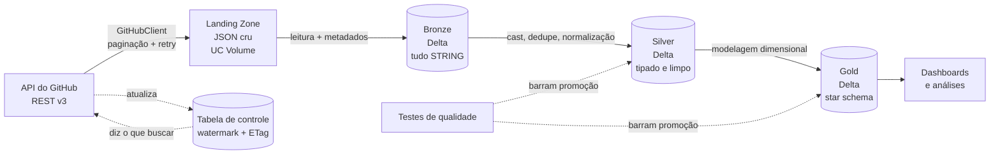
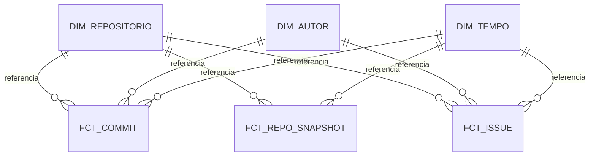

# Radar do Ecossistema de Dados — Documento de Projeto

> Documento vivo. Registra **por que** cada decisão foi tomada, não apenas o que foi feito.
> Atualizado ao final de cada etapa.

---

## Índice

1. [Contexto e objetivo](#1-contexto-e-objetivo)
2. [A problematização](#2-a-problematização)
3. [A fonte: API do GitHub](#3-a-fonte-api-do-github)
4. [Arquitetura](#4-arquitetura)
5. [Ingestão incremental: watermark e ETag](#5-ingestão-incremental-watermark-e-etag)
6. [Modelagem dimensional](#6-modelagem-dimensional)
7. [Decisões de tipagem](#7-decisões-de-tipagem)
8. [Decisões de engenharia de software](#8-decisões-de-engenharia-de-software)
9. [Diário de bordo](#9-diário-de-bordo)
10. [Roadmap e manutenção](#10-roadmap-e-manutenção)
11. [Referências](#11-referências)

---

## 1. Contexto e objetivo

Pipeline de dados fim-a-fim que ingere dados da **API REST do GitHub**, organiza-os em um
**lakehouse com arquitetura medalhão** sobre Delta Lake no Databricks, e entrega um
**modelo dimensional** capaz de responder perguntas sobre a saúde de projetos open source
do ecossistema de engenharia de dados.

O objetivo é duplo, e ambos importam:

| Objetivo | Como se manifesta no repositório |
|---|---|
| **Aprender** engenharia de dados moderna | Cada decisão documentada com a alternativa rejeitada |
| **Comprovar** competência para o mercado | Testes automatizados, CI, histórico de commits, documentação |

Um repositório de portfólio não é avaliado pelo código que roda — é avaliado pelo
**raciocínio visível**. É isso que este documento registra.

---

## 2. A problematização

### 2.1 Por que começar pela pergunta, não pelo dado

O erro mais comum em projeto de portfólio é começar pela fonte: *"achei uma API e carreguei
no Databricks"*. Quem avalia lê isso como tutorial reproduzido.

Engenharia de dados existe para responder pergunta de negócio. **A arquitetura é
consequência da pergunta**, nunca o contrário. Toda escolha técnica deste projeto é
rastreável até uma das perguntas abaixo.

### 2.2 A pergunta central

> **Quais ferramentas do ecossistema de engenharia de dados estão saudáveis, e quais estão
> morrendo? Onde há risco de concentração de manutenção?**

O recorte é deliberado: um engenheiro de dados analisando as ferramentas de engenharia de
dados. Sinaliza domínio de mercado, não apenas domínio de ferramenta.

### 2.3 As perguntas filhas e o que cada uma força na arquitetura

| # | Pergunta de negócio | Exigência arquitetural |
|---|---|---|
| 1 | O projeto acelera ou desacelera? Commits crescem — mas **por contribuidor ativo** também? | Série temporal + dimensão de tempo + normalização de métrica |
| 2 | **Bus factor**: quantas pessoas concentram 50% dos commits? | Análise de concentração; dimensão de autor conformada |
| 3 | Quanto tempo uma issue leva para receber a **primeira resposta** e para ser fechada? | Fato com múltiplos marcos temporais (*snapshot acumulado*) |
| 4 | Quando um repositório muda de linguagem, licença ou dono, o histórico antigo muda junto? | **Slowly Changing Dimension Tipo 2** |

A pergunta 4 é a que justifica a complexidade do modelo. Sem ela, SCD2 seria enfeite.

### 2.4 A cadeia causal

Nenhuma decisão técnica deste projeto foi escolhida por gosto. Cada uma é **forçada** pela
anterior:

```
Pergunta: "quais projetos de dados estão saudáveis?"
        ↓ para responder, é preciso histórico
Commits e issues de ~14 repositórios, ao longo do tempo
        ↓ esse dado só existe na API do GitHub
A fonte é uma API
        ↓ a API tem teto de 5.000 req/hora (medido, não suposto)
Não cabe puxar tudo, todo dia
        ↓ só é possível puxar "o que mudou"
Ingestão INCREMENTAL é obrigatória
        ↓ incremental exige lembrar onde parou
CHECKPOINT persistido entre execuções
        ↓ o checkpoint guarda watermark e ETag
O cliente precisa EXPOR etag e rate limit
        ↓ requests.get() cru não entrega isso de forma utilizável
Uma camada que traduz HTTP em contrato próprio
        ↓
config.py e GitHubClient
```

Leia de baixo para cima: **o `config.py` existe porque o GitHub tem rate limit.** Se a API
fosse ilimitada, metade deste projeto não existiria.

### 2.5 Escopo

14 repositórios do ecossistema de dados, definidos em `src/radar/config.py` — `apache/airflow`,
`apache/spark`, `dbt-labs/dbt-core`, `duckdb/duckdb`, `pola-rs/polars`, `delta-io/delta`,
`dagster-io/dagster`, `PrefectHQ/prefect`, `trinodb/trino`,
`great-expectations/great_expectations`, `apache/iceberg`, `apache/hudi`, `sqlfluff/sqlfluff`,
`datahub-project/datahub`.

A lista vive num único lugar, nunca espalhada pelos notebooks.

---

## 3. A fonte: API do GitHub

### 3.1 Por que API e não arquivo estático

Arquivo CSV é o modo fácil: está completo, é imutável, e ou lê ou não lê. API é o modo real,
e falha de sete formas que arquivo nenhum reproduz:

| Desafio exclusivo de API | Por que é competência valorizada |
|---|---|
| **Paginação** | Exige laço que sabe quando parar, sem assumir o total |
| **Falha parcial** | 2.000 chamadas, 3 falham. Aborta tudo? Retenta? Continua? |
| **Rate limit** | Backoff, concorrência controlada, orçamento de requisições |
| **Idempotência** | Reprocessar um período sem duplicar o que já existe |
| **Evolução de contrato** | Campo novo aparece; campo some |
| **Encoding** | UTF-8 mal declarado transforma `Ação` em `Ação` |
| **Resposta vazia com HTTP 200** | O modo de falha mais perigoso que existe |

### 3.2 A sondagem que determinou a arquitetura

Antes de projetar qualquer coisa, a API foi sondada com `curl`. As evidências **medidas**
abaixo determinaram o desenho da camada de ingestão:

| Evidência observada | Consequência de projeto |
|---|---|
| `"core": {"limit": 60}` sem token | 60 req/hora é inviável → autenticação obrigatória → gestão de segredo |
| `Link: <...page=2>; rel="next", <...page=7498>; rel="last"` | Paginação vive no **header HTTP**, não no corpo. O cliente precisa abstrair isso |
| `page=7498` com `per_page=2` (~15 mil commits em um repo, em um ano) | O histórico **não cabe em uma carga só** → ingestão incremental |
| `ETag: W/"5cdff9..."` | Requisição condicional possível |
| `X-RateLimit-Remaining` decrescendo 1 por chamada | O código pode ler o próprio orçamento e se auto-regular |

> **Princípio de projeto:** a ingestão incremental não foi escolhida por ser boa prática. Ela
> foi **deduzida de uma restrição real** — o rate limit torna a carga completa impossível.
> Copiar boas práticas é diferente de derivá-las.

### 3.3 Regra adotada: a API mente em silêncio

Durante a avaliação de uma fonte alternativa (API de Dados Abertos da Câmara dos Deputados),
a chamada aparentemente correta retornou **HTTP 200 com zero registros**. Faltava um
parâmetro não óbvio (`idLegislatura`).

Um pipeline construído sobre aquela chamada rodaria verde, todos os dias, entregando tabela
vazia — e ninguém perceberia por semanas.

Daí duas regras deste projeto:

1. **Sonde a API antes de projetar.** Meia hora de `curl` economiza dois dias.
2. **Contagem de controle é obrigatória.** Todo carregamento afirma quantos registros
   esperava. É o que transforma falha silenciosa em falha visível.

### 3.4 Por que não usar uma biblioteca pronta (PyGithub)

Decisão consciente, com alternativa rejeitada registrada:

| Motivo | Detalhe |
|---|---|
| **Wrappers escondem o que interessa** | PyGithub abstrai paginação e rate limit *para não pensarmos neles*. Mas rate limit e ETag **são o problema central deste projeto** |
| **O cliente é a aula** | O objetivo é aprender ingestão de API. Terceirizar isso é terceirizar a etapa |
| **Transferibilidade** | A maioria das APIs que se integra na carreira não tem biblioteca pronta |

Em contexto de trabalho, com prazo e sem objetivo didático, usar a biblioteca madura seria a
escolha correta. A decisão aqui é específica deste contexto.

---

## 4. Arquitetura

### 4.1 Visão geral



### 4.2 A landing zone

Toda ingestão aterrissa o dado **bruto, como veio**, em armazenamento durável, **antes** de
qualquer transformação. Neste projeto: JSON da API gravado em um Unity Catalog Volume,
particionado por repositório e período.

| Motivo | O que acontece sem a landing zone |
|---|---|
| **Reprocessamento** | Descobriu em junho que a regra estava errada desde janeiro? Sem o bruto, o dado correto não existe mais — e o rate limit impede rebaixar tudo |
| **Auditoria** | *"Esse número está errado."* Sem o original, não há como provar se o erro veio da origem ou do código |
| **Desacoplamento** | Transformação falhou às 3h? Reprocessa do arquivo. Não depende da origem |
| **A origem esquece** | API mantém uma janela de histórico. Quem guarda os anos é você |

Corolário: **ingestão e transformação são etapas separadas e independentes.**

### 4.3 Por que Unity Catalog Volume e não DBFS

DBFS está em desuso e não tem governança. Volume aparece no Catalog Explorer, tem controle
de permissão e participa do lineage.

### 4.4 Arquitetura medalhão

Três camadas, cada uma com **uma responsabilidade e uma regra inviolável**:

| Camada | Responsabilidade | Regra |
|---|---|---|
| **Bronze** | Cópia fiel da origem + metadados de proveniência | **Não se limpa nada.** Todo campo entra como `STRING` |
| **Silver** | Tipagem, deduplicação, normalização | Uma linha por chave. Ainda **não** é modelo dimensional |
| **Gold** | Modelo dimensional para consumo | Nomes em linguagem de negócio. Grão declarado |

**Por que bronze não limpa nada.** Corrigir dado na bronze destrói a capacidade de
reprocessar a partir da verdade original quando a regra de limpeza se revelar errada. Além
disso, o cast deve falhar na *silver* — onde há regra, log e teste — e não na ingestão, onde
o dado sequer chegaria para ser investigado.

**Por que silver não modela.** Misturar limpeza com modelagem produz código irrevisável e
força reprocessar a limpeza toda vez que o modelo muda.

**O custo-benefício das camadas:**

| Sem camadas | Com camadas |
|---|---|
| Regra de limpeza errada → rebaixar tudo (e a quota não permite) | Reprocessa da bronze, já armazenada |
| "Esse número está errado" → sem como saber a origem do erro | Compara bronze e silver lado a lado |
| Muda o modelo → refaz a limpeza junto | Silver intacta, só a gold muda |

### 4.5 Metadados de proveniência

Toda tabela bronze carrega, no mínimo:

| Coluna | Para quê |
|---|---|
| `_ingerido_em` | Quando esta linha entrou |
| `_arquivo_origem` | De qual carga veio |
| `_endpoint` | Qual chamada de API a produziu |

Sem isso não há resposta para *"de onde veio esta linha?"* — a primeira pergunta de qualquer
investigação de dado errado.

### 4.6 Namespace no catálogo

Convenção adotada: **`<projeto>_<camada>`** — `radar_bronze`, `radar_silver`, `radar_gold`.

| Benefício | Na prática |
|---|---|
| **Isolamento** | O próximo projeto usa `projeto2_bronze`. Nunca colide |
| **Limpeza trivial** | Abandonou o projeto? `DROP SCHEMA ... CASCADE`. Um comando |
| **Legibilidade** | `radar_gold.dim_repositorio` se explica sozinho |
| **Permissão por projeto** | `GRANT` no schema inteiro, não tabela a tabela |

> **Limitação de ambiente registrada:** em workspace pago, o padrão seria um **catálogo** por
> domínio ou ambiente (`dev`/`prod`). O Databricks Free Edition oferece apenas o catálogo
> `workspace`, então o namespace desce um nível e passa a ser o schema. Restrição contornada
> conscientemente, não ignorada.

---

## 5. Ingestão incremental: watermark e ETag

São os dois mecanismos que transformam uma carga impossível em uma carga barata. **Não são a
mesma categoria de coisa.**

### 5.1 Watermark — "até onde eu já fui"

O **maior valor já processado** de uma coluna monotônica (que só cresce). Guardado entre
execuções, vira o parâmetro `?since=` da próxima.

Três armadilhas, e como são tratadas:

| Armadilha | Consequência | Tratamento |
|---|---|---|
| **Dado que chega atrasado** | Commit com data retroativa (rebase, merge de branch antiga) nunca é capturado por `since` — perda silenciosa | **Janela de sobreposição**: grava o watermark 1 dia atrás do máximo real |
| **Fronteira `>` vs `>=`** | `>` perde o registro exatamente no limite | Sempre `>=`. **Perder dado é pior que processar duas vezes** |
| **Relógios diferentes** | Usar `datetime.now()` local ignora o fuso do servidor | O watermark vem da **maior data efetivamente ingerida** |

A sobreposição só é segura porque a carga é **idempotente**: a gravação usa `MERGE` pela
chave natural (o `sha` do commit), nunca `append` cego.

> **Sobreposição e idempotência são um par.** Sobreposição sem idempotência duplica;
> idempotência sem sobreposição perde dado atrasado.

### 5.2 ETag — "mudou?"

Impressão digital que o servidor calcula sobre o conteúdo. Guardada e devolvida no header
`If-None-Match`, faz o servidor responder `304 Not Modified` quando nada mudou.

**Medição real feita neste projeto:**

| Chamada | Sem token | Com token |
|---|---|---|
| 1ª (sem ETag) | `200` — restante 59 | `200` — restante 4999 |
| 2ª (com ETag) | `304` — restante **58** ⬅ gastou | `304` — restante **4999** ⬅ **não gastou** |
| 3ª (com ETag) | — | `304` — restante 4999 |
| 4ª (sem ETag) | `200` — restante 57 | `200` — restante 4998 |

Conclusão: **em requisição autenticada, o `304` não consome quota.** Sem autenticação,
consome — e testar só nessa condição levaria à conclusão errada de que ETag é inútil.

> **Regra derivada:** teste nas condições reais de operação, não numa aproximação delas.

### 5.3 A diferença que importa

| | **Watermark** | **ETag** |
|---|---|---|
| É o quê | valor que **nós** calculamos e guardamos | header do **protocolo HTTP** |
| Quem cria | nós, a partir do dado ingerido | o servidor |
| Como entra na requisição | parâmetro `?since=` | header `If-None-Match` |
| O que controla | **quanto dado vem** no corpo | **se a pergunta custa quota** |
| Quando nada mudou | gasta 1 requisição, devolve lista vazia | `304`, gasta 0 |

**ETag não reduz volume** (é binário: mudou ou não). **Watermark não economiza requisição**
(a chamada acontece de qualquer jeito). Um é filtro, o outro é cache de validação.

### 5.4 A armadilha de combinar os dois — e o padrão sentinela

O ETag é calculado por **URL + parâmetros**. Como o watermark muda a cada execução, a URL
muda, e o ETag guardado nunca casa:

```
Segunda:  GET /commits?since=2026-08-17   → ETag W/"aaa"  (guardado)
Terça:    GET /commits?since=2026-08-18   + If-None-Match: W/"aaa"
                          ↑ URL diferente → nunca dá 304
```

**Solução adotada — sentinela:** usar o ETag numa URL **estável**, cujo único papel é
responder *"teve movimento?"*.

```
Para cada repositório:

  1. SENTINELA (barata, URL fixa)
     GET /repos/{repo}/commits?per_page=1  + If-None-Match: <etag guardado>
       → 304 → nada mudou. Pula o repositório.        CUSTO: ZERO
       → 200 → há novidade. Guarda o novo ETag e segue.

  2. COLETA (cara, URL variável)
     GET /repos/{repo}/commits?since=<watermark>&per_page=100
       → pagina seguindo o header Link até acabar

  3. ATUALIZA O CHECKPOINT
     watermark = maior data ingerida menos 1 dia
     etag      = o da sentinela
```

### 5.5 O ganho, em números

14 repositórios, execução diária:

| Estratégia | Requisições/dia | Cabe na quota de 5.000? |
|---|---|---|
| Nenhuma — baixa tudo sempre | milhares (`apache/spark` sozinho tem centenas de páginas) | ❌ estoura |
| Só watermark | ~14 (uma página por repo, mesmo os parados) | ✅ |
| Watermark + ETag | ~5 (os repos parados morrem na sentinela, de graça) | ✅ com folga |

### 5.6 A tabela de controle

Onde a memória do pipeline mora. Criada na Etapa 2 como
`workspace.radar_bronze.controle_ingestao`, com grão de uma linha por par
`(repo, endpoint)`:

| Coluna | Conteúdo |
|---|---|
| `repo` | `duckdb/duckdb` |
| `endpoint` | `commits`, `issues`, ... |
| `watermark` | maior data ingerida, com a sobreposição já aplicada |
| `etag` | ETag da sentinela |
| `ultima_execucao` | quando rodou |
| `status` | `ok` / `erro` |
| `mensagem` | detalhe do erro, quando houver |
| `registros` | quantos registros a última carga trouxe |

É ela que transforma um script que roda uma vez num processo que roda todo dia sem refazer
trabalho.

### 5.7 Limitação conhecida: o teto de páginas apaga histórico em silêncio

Descoberta com dado real, na verificação da Etapa 3. Não é hipótese: cinco dos catorze
repositórios estão incompletos neste momento.

O `limite_paginas` existe como válvula de segurança contra estourar a quota. Sozinho, seria
uma escolha consciente. O problema é a interação com o watermark:

1. A API do GitHub devolve commits **do mais novo para o mais antigo**
2. Com `limite_paginas=5`, coletamos os **500 mais recentes** dentro da janela pedida
3. `proximo_checkpoint` grava `watermark = data_do_commit_mais_novo - sobreposição`
4. A execução seguinte parte dali — e **o que ficou para trás nunca mais é buscado**

Medido em 2026-08-22, com janela de 90 dias (desde 24/05):

| Repositório | Commit mais antigo coletado | Buraco |
|---|---|---|
| `trinodb/trino` | 2026-07-24 | 2 meses |
| `apache/spark` | 2026-07-27 | 2 meses |
| `apache/airflow` | 2026-07-31 | 2 meses |
| `datahub-project/datahub` | 2026-07-16 | ~2 meses |
| `dbt-labs/dbt-core` | 2026-07-03 | ~6 semanas |

Os outros nove alcançaram o início da janela e estão completos.

**O que torna isso grave não é a falta de dado — é o silêncio.** O pipeline segue com
`status='ok'`, sem erro e sem aviso. E nenhuma bateria de qualidade pega: todas verificam o
dado que chegou; **nenhuma pergunta o que deveria ter chegado e não chegou.**

É a seção 3.3 deste documento — *a API mente em silêncio* — com o papel invertido: aqui quem
omite é o nosso próprio código.

Correção planejada, em ordem de prioridade:

| # | Mudança | Estado |
|---|---|---|
| 1 | `paginar()` informa que parou pelo teto; controle grava `status='truncado'`, e a bateria da bronze verifica com `carga_truncada` | ✅ feito |
| 2 | Não avançar o watermark quando houve truncagem | ✅ feito |
| 3 | Backfill em janelas, com o parâmetro `until` da API | ☐ |

**A interação com o ETag.** Um checkpoint truncado faz a ingestão **ignorar o ETag
guardado**. A sentinela olha apenas o topo da lista: se nada mudou lá, ela responde
`304` e o repositório é pulado — justamente aquele que se sabe incompleto. Sem essa
exceção, a recuperação nunca aconteceria, e o repositório ficaria travado como
`truncado` para sempre, sendo pulado a cada execução.

**Por que o item 2 não avança em vez de recuar.** A API entrega commits do mais
novo para o mais antigo, e `since` só aceita limite inferior — não existe forma de
voltar no tempo dentro do mesmo mecanismo. Preservar o watermark faz a execução
seguinte tentar o mesmo intervalo: ela recoleta o que já tem, sem duplicar (a carga
é idempotente), e completa assim que o teto for suficiente. O custo é quota gasta em
releitura; o ganho é que a falta deixa de ser permanente e passa a ser visível a cada
execução, até alguém agir.

O item 3 só é necessário para janelas grandes demais para caber num teto razoável.
Enquanto a janela for de 90 dias, elevar `limite_paginas` resolve.

---

## 6. Modelagem dimensional

### 6.1 Grão — a decisão que precede todas

**Grão** é o que significa uma linha da tabela fato. Definir o grão **antes** de escrever
código é a regra número um de modelagem dimensional; quase todo erro de star schema nasce de
grão mal declarado.

Cada tabela fato declara seu grão explicitamente, em comentário no código e neste documento.

### 6.2 Os três tipos de fato

Kimball define três tipos de tabela fato. Este projeto usa **os três** — incomum em portfólio
e diferencial em entrevista.

| Tipo | Tabela | Grão | Comportamento |
|---|---|---|---|
| **Transação** | `fct_commit` | um commit | Evento pontual e imutável. Só insere |
| **Snapshot periódico** | `fct_repo_snapshot` | um repositório **por dia** | Retrato de métricas num instante: stars, forks, issues abertas |
| **Snapshot acumulado** | `fct_issue` | uma issue, com marcos | `aberta_em` → `primeira_resposta_em` → `fechada_em`. A linha é **atualizada** conforme o processo avança |

### 6.3 A decisão contraintuitiva: onde ficam as stars

Tentação natural: colocar `stars` em `dim_repositorio` com SCD2, já que muda ao longo do
tempo. **Errado, e o erro é estrutural.**

Stars mudam *todo dia*. Com SCD2, cada repositório geraria uma versão por dia: 14 repos × 365
dias ≈ 5 mil linhas por ano numa dimensão que deveria ter 14. Em poucos anos, a "dimensão"
fica maior que o fato. Isso tem nome: **dimensão que explode por atributo volátil.**

| Natureza do atributo | Onde mora |
|---|---|
| Muda **raramente** e queremos saber *"como estava naquela data"* — linguagem, licença, dono, arquivado | `dim_repositorio`, com **SCD2** |
| Muda **continuamente** e é uma medida — stars, forks, watchers, issues abertas | `fct_repo_snapshot` (**fato**) |

**Teste prático:** *isso é atributo ou medida?* Se você somaria, tiraria média ou plotaria
numa linha do tempo, **é medida — vai para o fato**. Stars é medida. Licença é atributo.

### 6.4 Slowly Changing Dimension Tipo 2

Problema que resolve: um repositório muda de licença em março. O relatório de janeiro deve
mostrar a licença **antiga** (a que valia em janeiro) ou a **nova**?

| Tipo | Comportamento | Consequência |
|---|---|---|
| SCD 1 | Sobrescreve | O histórico é reescrito. O relatório de janeiro muda sozinho |
| **SCD 2** | Nova linha versionada | O relatório de janeiro permanece igual para sempre |

Formato adotado:

| sk_repositorio | repo_id | licenca | valido_de | valido_ate | flag_atual |
|---|---|---|---|---|---|
| `a1f…` | 1296269 | MIT | 2024-01-01 | 2024-03-15 | `false` |
| `b7c…` | 1296269 | Apache-2.0 | 2024-03-15 | *null* | **`true`** |

- `repo_id` — chave **natural**, vem da origem, repete entre versões
- `sk_repositorio` — chave **substituta**, uma por versão; é o que o fato referencia
- `valido_ate = NULL` marca a versão vigente

**Invariantes verificadas por teste automatizado:**

1. Exatamente **uma** versão vigente por chave natural
2. `flag_atual` e `valido_ate` contam a mesma história
3. A chave substituta é única

### 6.5 Chaves substitutas determinísticas

A chave substituta é um **hash** da chave natural somada à data de início da versão — nunca
um contador incremental.

Motivo: um contador (`row_number`) produziria chaves diferentes a cada reprocessamento, e
todos os fatos passariam a apontar para a linha errada. Hash é reprodutível — reprocessar do
zero gera exatamente as mesmas chaves.

### 6.6 Modelo alvo



---

## 7. Decisões de tipagem

Onde mais gente erra em silêncio. A estratégia varia por camada:

| Camada | Estratégia | Justificativa |
|---|---|---|
| Bronze | tudo `STRING` | Preserva a origem. O cast falha onde há regra e log |
| Silver | tipo real, **cast explícito por coluna** | Aqui o tipo vira contrato |
| Gold | tipo do negócio | Otimizado para consulta |

Decisões específicas:

| Campo | Tipo errado comum | Tipo correto | Consequência do erro |
|---|---|---|---|
| Valores monetários | `double` | `decimal` | `0.1 + 0.2 = 0.30000000000000004`. Somando milhares de linhas, o total não bate por centavos |
| Identificadores numéricos (CEP, CNPJ, SKU) | `int` | `string` | `01310` vira `1310`. **Se você nunca vai somar, não é número** |
| Datas ISO da API | `string` | `timestamp` | Ordenação alfabética, `datediff` impossível, partição por data quebrada |
| Contagens (`stars`, `forks`) | `string` | `int` | Média de string não existe |
| Status / categorias | `string` livre | `string` + **domínio validado** | Origem manda `Open`, `open`, `OPEN` → três categorias, mesma coisa |
| `sha` de commit | tentar converter | `string` | É hash. Não é número |

Regra que resume todas: **tipo não é detalhe de implementação, é contrato.**

---

## 8. Decisões de engenharia de software

### 8.1 Lógica em `src/`, orquestração em `notebooks/`

```
radar-ecossistema-dados/
├── src/radar/          # lógica: Python puro, testável, importável
├── notebooks/          # orquestração fina: lê, chama função, escreve
├── tests/              # pytest — roda no CI, sem cluster
├── docs/               # arquitetura e decisões
└── .github/workflows/  # CI (nome e local obrigatórios)
```

Por que notebook **não** guarda lógica:

| Problema do notebook | Consequência |
|---|---|
| Diff ilegível no Git | Ninguém revisa o PR |
| Não pode ser importado | Lógica copiada e colada entre notebooks |
| Não pode ser testado | Sem CI, sem garantia contra regressão |
| Estado oculto entre células | Roda na sessão interativa, quebra no job agendado |

Resultado concreto: os 16 testes do cliente rodam em **0,13 segundo**, sem workspace
Databricks e sem consumir quota da API.

### 8.2 Fonte da verdade é o Git

```
🖥️ VS Code  --push-->  🌐 GitHub  --pull-->  ☁️ Databricks
   escreve             verdade              executa
```

Código escrito dentro do Databricks vive só lá: sem histórico, sem revisão, sem CI, e
invisível para quem avalia o portfólio. **O código nasce no PC e viaja para o Databricks,
nunca o contrário.**

### 8.3 Ordem de construção: contra a direção das dependências

```
config.py          ← não depende de nada        (construído 1º)
   ↑
github_client.py   ← depende de config          (2º)
   ↑
notebook ingestão  ← depende do cliente         (3º)
   ↑
bronze → silver → gold                          (depois)
```

Começar pelo módulo sem dependências permite que cada camada seja **provada** antes da
seguinte existir. Assim, um erro no cliente é necessariamente do cliente — o bug fica
encurralado numa camada, em vez de exigir depurar tudo ao mesmo tempo.

### 8.4 Domar a fronteira

Todo sistema tem bordas instáveis: API de terceiro, arquivo de fornecedor, banco legado. A
regra é **isolar a instabilidade num único módulo**, para que o resto do sistema converse
apenas com o contrato próprio.

O `GitHubClient` devolve um `Resposta` (dataclass própria), nunca o objeto do `requests`.
Se amanhã a biblioteca HTTP mudar, **um** arquivo muda.

### 8.5 Injeção de dependência

O token e a sessão HTTP são **injetados** no construtor, nunca lidos de dentro da classe:

| Motivo | Consequência prática |
|---|---|
| Testabilidade | O teste passa `"token-de-teste"` e uma `SessaoFalsa` sem mexer em variável de ambiente |
| Portabilidade | Local vem do `.env`; no Databricks vem do Secret Scope. A classe não muda |
| Responsabilidade única | Cliente HTTP fala HTTP; não é trabalho dele descobrir onde mora o segredo |

O pagamento veio no Passo 1.6: três erros `500` seguidos e um `429` foram testados em
milissegundos, sem derrubar servidor nenhum.

O token também **nunca vira atributo** (`self.token`) — assim não aparece em `repr()`, log
ou stack trace. Há um teste automatizado que garante isso.

### 8.6 Ambiente virtual e versões congeladas

`venv` por projeto; `requirements.txt` gerado por `pip freeze --exclude-editable`.

`pip freeze` grava a versão exata de tudo, inclusive dependências indiretas —
**reprodutibilidade**. Um `requirements.txt` com `requests` solto instala a versão nova de
amanhã e quebra sem que nada tenha mudado no código.

`--exclude-editable` impede que o próprio pacote entre na lista apontando para um caminho
local que não existe em outra máquina.

**Regra adotada: sempre `python -m pip`, nunca `pip` sozinho.** Ver [diário de bordo #5](#9-diário-de-bordo).

### 8.7 Gestão de segredo

| Ambiente | Mecanismo | Estado |
|---|---|---|
| Local | `.env` ignorado pelo Git; `.env.example` versionado documenta o contrato | ✅ implementado |
| Databricks | Secret Scope `radar/github_token` (`dbutils.secrets.get`) — o token não aparece em tela nem no log | ✅ disponível no Free Edition, implementado em `notebooks/01_setup_credenciais.py` |

Se o Secret Scope não estiver disponível, o plano B é `dbutils.widgets` — funciona, mas é
inferior porque o valor fica no histórico do job. **A limitação será documentada aqui, não
escondida.**

**Separação de notebooks de setup.** O provisionamento de credencial vive em
`01_setup_credenciais.py`, separado de `00_setup_catalogo.py`. Motivo principal: o notebook
de credencial **exige entrada humana** (o token é digitado num widget) e por isso não pode ser
automatizado num job. Mantê-lo junto do setup de catálogo tornaria aquele inautomatizável
também. Os dois também têm ciclos de vida distintos — o catálogo muda com a estrutura do
projeto; o token, a cada rotação (~90 dias).

**Princípio do menor privilégio** aplicado em três frentes: token *fine-grained* e
*read-only* sobre repositórios públicos; política de execução do PowerShell ajustada em
escopo `CurrentUser` e não na máquina inteira; `.gitignore` validado **antes** de o arquivo
de credencial existir.

### 8.8 Quebras de linha padronizadas

`.gitattributes` com `* text=auto eol=lf`.

Evita a praga de time misto Windows/Mac/Linux — o PR com "500 linhas alteradas" quando só uma
mudou. E evita o bug documentado no [diário de bordo #3](#9-diário-de-bordo).

---

## 9. Diário de bordo

Esta seção existe de propósito. Quem avalia um portfólio quer saber se o candidato
**diagnostica** ou apenas executa.

| # | Sintoma | Causa raiz | Lição generalizável |
|---|---|---|---|
| 1 | `git clone` → `Repository not found` | Erro de digitação no usuário **e** nome do repositório com `_` em vez de `-` | O GitHub devolve a mesma mensagem para *não existe*, *nome errado* e *privado sem acesso* — de propósito, para não vazar a existência de repositórios privados. Desconfie de digitação primeiro |
| 2 | `Activate.ps1` bloqueado | Política de execução padrão do Windows é `Restricted` | `RemoteSigned` em escopo `CurrentUser` é o equilíbrio: script local roda, script baixado exige assinatura, e não requer admin |
| 3 | `git check-ignore` afirmando que `data/` estava ignorado — **sem que a regra existisse** | `.gitignore` com **CRLF**: numa linha em branco, o `\r` residual é lido como padrão e o comando devolve **falso positivo para qualquer caminho**. Reproduzido em repositório isolado | **Ferramenta de diagnóstico também erra.** Em questão de segurança, valide pelo comportamento real (`git status` com o arquivo criado), não pelo que o utilitário afirma |
| 4 | Arquivo `env` (sem ponto) contendo o token, **preparado para commit** | O Explorer do Windows recusa nomes iniciados por ponto | **Credencial exposta é credencial queimada.** Se tivesse havido push, apagar o arquivo não resolveria — o token permanece no histórico. O procedimento correto é *revogar*, gerar novo, e só então limpar |
| 5 | `pip install -e .` instalando no Python **global**, com o venv aparentemente ativo | O `.venv` foi criado **sem `pip.exe`**; o PATH caiu no pip do sistema | **Sempre `python -m pip`, nunca `pip`.** `pip` é um executável resolvido pelo PATH e pode apontar para outro interpretador; `python -m pip` usa o pip do Python que está rodando. Verifique com `python -c "import sys; print(sys.executable)"` |
| 6 | Medição de consumo de quota resultando em `-1` | O endpoint `/rate_limit` serve valor **em cache** (reportava 5000 enquanto as respostas reais diziam 4991) e **não** consome quota | **Meça pelo header da resposta que interessa** (`X-RateLimit-Remaining`), não por um endpoint de status separado. Valida a decisão de expor `rate_remaining` em toda `Resposta` |
| 7 | `SyntaxError` apontando para `def paginar(` | O `)` que fechava o `return Resposta(` foi sobrescrito ao colar | `SyntaxError` quase sempre aponta a linha **seguinte** ao erro real — o interpretador só percebe o problema ao encontrar um token inesperado. **Olhe sempre a linha anterior**: costuma ser parêntese, colchete ou aspas sem fechar |
| 8 | `TABLE_OR_VIEW_NOT_FOUND` no meio do laço de ingestão | O `00_setup_catalogo` tinha sido dividido em dois notebooks e só o de credenciais chegou a rodar — a tabela de controle nunca foi criada | **Dependência ausente deve falhar cedo e nomeada.** Uma verificação de pré-voo antes da primeira requisição troca um erro do motor no meio do processamento por uma mensagem que identifica o que falta, e evita gastar quota antes de descobrir. Corolário achado no mesmo diagnóstico: a leitura do checkpoint estava **fora** do `try/except`, então o erro atravessou a proteção que existia justamente para isolar falha por repositório |
| 9 | `CONFIG_NOT_AVAILABLE` ao definir `spark.sql.sources.partitionColumnTypeInference.enabled` | O Serverless aceita alterar apenas uma lista fechada de configurações do Spark | **Em ambiente gerenciado, expresse a intenção no código, não na sessão.** O mesmo efeito veio de um `cast("string")` na projeção: explícito, versionado e imune a restrição de plataforma. Configuração de sessão é global, invisível para quem lê o código depois, e pode simplesmente não existir no ambiente |
| 10 | Correção em `src/` sem efeito algum depois do `git pull` | Módulo já importado permanece em `sys.modules` pelo resto da vida do interpretador | **Notebook e módulo importado têm ciclos de vida diferentes.** A célula reexecuta e reflete a mudança; o módulo fica congelado até `dbutils.library.restartPython()`. É o preço da decisão 8.1 — lógica em `src/` — e vale pagá-lo |
| 11 | `SyntaxError: invalid syntax` na primeira célula de um notebook | `%load_ext autoreload` é magic do **IPython**, não do Databricks; o que a plataforma não reconhece como magic vai direto para o parser do Python | **Prática de Jupyter não é automaticamente portátil para o Databricks.** A plataforma tem as ferramentas dela — `restartPython()` no lugar do `autoreload` |
| 12 | `UnsatisfiedLinkError: NativeIO$Windows.access0` ao ler arquivo local pelo Spark | Leitura de arquivo no Windows passa pela camada nativa do Hadoop, que exige `winutils.exe` e `hadoop.dll` | **Limitação de ambiente também é sinal de projeto.** Antes de instalar o binário de terceiros, a saída foi separar I/O de transformação (`ler_landing` / `projetar`) — desenho melhor de qualquer forma, e que tornou a regra de negócio testável sem tocar o disco |
| 13 | Teste escrito com a resposta "óbvia" falhou: `from_json` sobre JSON inválido | Em modo permissivo ele não devolve `NULL` na coluna, e sim um struct com **todos os campos** nulos | **A detecção de registro inválido não pode ser `coluna IS NULL`.** O desenho da quarentena da Etapa 3 mudou por causa disso — antes de existir. Sem sessão Spark local, o erro só apareceria com o pipeline já rodando |
| 14 | `NOT_SUPPORTED_WITH_SERVERLESS: PERSIST TABLE` na carga da silver | `df.cache()` não existe em compute gerenciado | **A saída não é procurar um substituto para persistir, é reduzir passagens** — ou materializar em tabela, que é armazenamento que a plataforma oferece. Terceiro caso da mesma família (`spark.conf` fechada, magic do IPython recusada, agora `cache`): *máquina que você não controla é máquina cujo motor você não configura* |
| 15 | Depois de corrigido e enviado, o **mesmo** erro por três rodadas | O `git pull` chegou, o `restartPython()` não. E o diagnóstico usado para descartar essa hipótese estava errado: `inspect.getsource(modulo)` lê o **arquivo em disco**, não o objeto carregado | **Escolha a ferramenta que observa o que você quer saber.** Para saber o que está em execução, pergunte à memória: `hasattr(modulo, "SIMBOLO_NOVO")`. A pergunta feita ao alvo errado devolve uma resposta verdadeira e inútil, e custou três tentativas de correção às cegas |
| 16 | `[FALHA] 3. merge dos aprovados: AttributeError` — lido como defeito no `MERGE` | Uma célula de diagnóstico temporária, escrita duas versões antes, chamava função que a refatoração removeu. O `MERGE` nunca chegou a executar | **`try/except` com rótulo próprio descreve a sua intenção, não o que falhou.** O rótulo `"merge dos aprovados"` apareceu colado a um erro ocorrido antes do merge. Andaime de diagnóstico tem prazo de validade — apague quando o diagnóstico terminar |

---

## 10. Roadmap e manutenção

### 10.1 Etapas

| Etapa | Entrega | Competência exercitada | Status |
|---|---|---|---|
| **0** | Ambiente, estrutura do repositório, gestão de segredo | Git, isolamento de ambiente, segurança | ✅ concluída |
| **1** | `GitHubClient` — cliente da API | Paginação, retry/backoff, rate limit, ETag, testes com dublê | ✅ concluída |
| **2** | Tabela de controle + landing zone + camada bronze | Checkpoint, JSON cru particionado, idempotência, proveniência | ✅ concluída |
| **3** | Camada silver | Tipagem, dedupe, normalização, testes de qualidade | ✅ concluída |
| **4** | Gold — dimensões | Star schema, SCD2, chaves substitutas | ⏳ próxima |
| **5** | Gold — os três fatos | Transação, snapshot periódico, snapshot acumulado | ☐ |
| **6** | CI, orquestração, README | GitHub Actions, Databricks Workflows, documentação | ☐ |

### 10.2 Detalhe da Etapa 1 (concluída)

| Sub-passo | Entrega |
|---|---|
| 1.1 | `pyproject.toml` — pacote importável, instalação editável |
| 1.2 | `config.py` — constantes, zero dependência externa |
| 1.3 | `get()` + contrato `Resposta` + requisição condicional com ETag |
| 1.4 | `paginar()` — gerador preguiçoso seguindo o header `Link` |
| 1.5 | Retry com backoff exponencial e jitter, respeitando `Retry-After` |
| 1.6 | 16 testes automatizados com sessão dublê — 0,13s, sem rede |

### 10.3 Detalhe da Etapa 2 (concluída)

| Sub-passo | Entrega |
|---|---|
| 2.1 | Setup do catálogo — schemas, Volume da landing zone, tabela de controle |
| 2.2 | `controle.py` — checkpoint por `(repo, endpoint)`, gravado por `MERGE` |
| 2.3 | `ingestao.py` — sentinela por ETag, coleta e gravação JSONL particionada |
| 2.4 | Notebook de ingestão — janela de histórico na 1ª carga, falha isolada por repositório |
| 2.5 | `bronze.py` — JSONL cru → Delta, `MERGE` idempotente por chave natural |
| 2.6 | `qualidade.py` — bateria de verificações e contagem de controle, com histórico |

### 10.4 Detalhe da Etapa 3 (concluída)

| Sub-passo | Entrega |
|---|---|
| 3.1 | Schema do commit declarado em DDL — data permanece `STRING` |
| 3.2 | Tipagem e normalização coluna a coluna, com `try_to_timestamp` |
| 3.3 | Quarentena com motivo; invariante `bronze = silver + quarentena` |
| 3.4 | Carga incremental por watermark próprio, com **upsert** |
| 3.5 | Notebook `05_silver` |
| 3.6 | Bateria da silver — regras sobre o significado do dado |

**A decisão que define a camada.** O schema declara o JSON **como ele chega**: data ISO é
`STRING`, porque em JSON é string. A conversão para `TIMESTAMP` acontece depois, explícita,
onde o fracasso é detectável. Declarar `TIMESTAMP` no `from_json` faria uma data inválida
virar `NULL` silenciosamente dentro da leitura — exatamente o que a seção 4.4 proíbe.

E `try_to_timestamp` em vez de `to_timestamp`: com ANSI ligado, o cast comum lança exceção e
um único registro torto derruba a carga inteira.

**O `MERGE` da silver tem `WHEN MATCHED THEN UPDATE`, e o da bronze não.** A diferença é de
natureza: linha de bronze é cópia da origem, e corrigi-la destruiria a evidência; linha de
silver é derivação, e uma regra de normalização melhor deve substituir o valor antigo.

**Verificação com dado real** — 5.646 commits, 14 repositórios, 2026-08-23:

| Medida | Valor |
|---|---|
| bronze = silver + quarentena | 5.646 = 5.646 + 0 ✅ |
| Verificações da bateria | 11 de 11 aprovadas, 0 violações |
| Commits sem conta do GitHub (`author` nulo) | **80** — 21% do `dagster-io/dagster` |
| Commits de bot | **594** (10,5%) |
| Assinatura verificada | 4.191 (74%) contra 1.455 sem assinatura |

Os dois primeiros números justificam decisões de projeto que, sem dado real, seriam apenas
argumento: `author` nulável não era zelo excessivo, e `bot` no domínio de `github_tipo` era
carga útil — sem ele, 594 linhas teriam disparado aviso.

**Testes:** 229 no total — 169 puros (0,3s) e 60 com sessão Spark local.

**Idempotência, medida no transaction log.** Sete versões da tabela bronze, em três
sessões e quatro clusters diferentes: a primeira inseriu 200 linhas, as seis seguintes
inseriram zero — todas lendo as mesmas 200 linhas de origem. Nessas seis,
`numTargetFilesAdded` e `numTargetBytesAdded` ficaram em `0`: o `MERGE` sem
correspondência não reescreve arquivo. E `matchedPredicates` vazio em todas registra,
no próprio log, que esta tabela não tem caminho de `UPDATE`.

### 10.5 Fluxo de trabalho

```powershell
# 1. ativar o ambiente
.\.venv\Scripts\Activate.ps1

# 2. trabalhar em src/ e tests/

# 3. laco rapido: so os testes que nao sobem JVM
pytest -m "not spark"

# 4. antes de commitar: a suite inteira
pytest

# 5. commit descritivo
git add .
git status          # SEMPRE revise antes de commitar
git commit -m "feat: descricao do que mudou"
git push

# 6. no Databricks: botao Pull no Git folder, e rodar o notebook
```

#### Sessão Spark local

`pyspark` é dependência de **desenvolvimento** (`pip install -e ".[dev]"`), não de
execução: no Databricks o motor vem do cluster, e instalá-lo lá conflitaria com o runtime.

A sessão local cobre schema, `from_json`, casts, decodificação de partição e
deduplicação. **Não** cobre Delta, Volume nem Unity Catalog — `MERGE`, `saveAsTable` e
`DESCRIBE HISTORY` seguem validados apenas no Databricks.

| Variável | Para quê |
|---|---|
| `PYSPARK_PYTHON` | resolvida sozinha no `conftest.py`, a partir do interpretador que roda os testes; sem ela o worker falha com `Accept timed out` |
| `HADOOP_HOME` | no Windows, aponta para o diretório com `winutils.exe` e `hadoop.dll`; sem ela, os testes que leem arquivo são **pulados**, não quebrados |

`HADOOP_HOME` mora no `.env`, que não é versionado — o repositório continua clonável em
qualquer máquina.

> **Limite a ter em mente:** o runtime do Databricks é mais novo que o `pyspark` do venv.
> Os testes locais validam a nossa lógica, não paridade de comportamento entre versões
> do motor.

### 10.6 Convenção de mensagens de commit

Conventional Commits:

| Prefixo | Uso |
|---|---|
| `feat:` | Nova funcionalidade |
| `fix:` | Correção de defeito |
| `test:` | Testes |
| `docs:` | Documentação |
| `refactor:` | Reestruturação sem mudança de comportamento |
| `chore:` | Manutenção, configuração |

### 10.7 Regras de manutenção deste documento

1. Ao final de cada etapa, atualizar a tabela de status da seção 10.1
2. Toda decisão com alternativa rejeitada vira uma linha nas seções 4 a 8 — registre
   **a alternativa descartada e por quê**; é isso que demonstra critério
3. Todo problema que custou mais de 30 minutos vira uma linha na seção 9
4. Se uma decisão for revertida, **não apague** — registre a reversão e o motivo. Decisão
   revertida com justificativa é mais valiosa que decisão que nunca existiu

### 10.8 Melhorias planejadas

Viram commits de evolução, e essa evolução fica visível no histórico:

- **Tornar a truncagem por `limite_paginas` visível** e recuperar o histórico perdido
  (seção 5.7) — é a única pendência que afeta a completude do dado
- Migrar a leitura do token para Databricks Secret Scope
- GitHub Actions rodando `pytest` a cada push e PR
- Concorrência controlada na ingestão (vários repositórios em paralelo, respeitando quota)
- Adicionar `dbt` sobre a camada gold, para exercitar analytics engineering
- Publicar a documentação de linhagem gerada pelo Unity Catalog

---

## 11. Referências

| Tema | Fonte |
|---|---|
| Modelagem dimensional | Kimball & Ross, *The Data Warehouse Toolkit*, 3ª ed. |
| Arquitetura medalhão | Documentação do Databricks — Medallion Architecture |
| Delta Lake e `MERGE` | Documentação do Delta Lake — Upsert / SCD |
| API do GitHub | `docs.github.com/rest` — paginação, rate limit, requisições condicionais |
| Conventional Commits | `conventionalcommits.org` |
